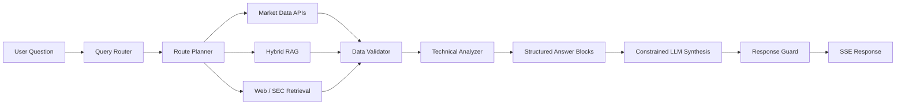

<div align="center">

# Financial Asset QA System

### Trustworthy Financial AI with Deterministic Data & Numerical Guardrails

**Keep market facts and calculations outside the language model; use the LLM as a constrained synthesis layer rather than an unchecked source of truth.**

`FastAPI` · `React` · `Hybrid RAG` · `Redis` · `Market APIs` · `SEC EDGAR` · `SSE` · `Response Guardrails`

[Full Technical README](../README.md) · [Backend](../backend/) · [Frontend](../frontend/) · [Build the RAG Index](../build_rag_index.py)

</div>

---

## Why this project matters

Financial QA is a poor fit for a black-box “LLM + tools” loop when numerical correctness and provenance matter. This project uses a **deterministic multi-stage pipeline** in which routing, data acquisition, calculation, validation and answer composition are explicit stages.

The central architecture decision is simple:

> **The LLM writes analysis. It does not own the numbers.**

## Request Flow



## Reliability Design

| Risk | System response |
|---|---|
| LLM invents current market data | market questions are routed to external data tools rather than generated from model memory |
| LLM performs unreliable arithmetic | indicators and quantitative calculations are computed by backend code |
| Correct number, wrong semantic field | `ResponseGuard` binds generated claims against **value + field + timestamp** context |
| Missing / incomplete source data | `DataValidator` can stop the answer before synthesis |
| Slow language generation blocks useful data | structured `blocks` are emitted before streamed prose |
| Model/provider failure | degraded mode can preserve structured tool-backed output instead of returning a blank experience |

## Evidence — what is actually implemented

| Capability | Repository evidence |
|---|---|
| Query orchestration | `QueryRouter`, `RoutePlanner`, `AgentCore` |
| Concurrent tool execution | `ToolExecutor` with staged market / enrichment execution |
| Market-data layer | yfinance, akshare with Stooq / Alpha Vantage extension paths |
| Knowledge retrieval | multi-domain ChromaDB + BGE + BM25 + RRF |
| External research | Tavily and SEC EDGAR service paths |
| Quantitative analysis | RSI, MACD, Bollinger Bands, support / resistance calculations |
| Input-side validation | `DataValidator` verifies minimum data requirements |
| Output-side validation | `ResponseGuard` checks numerical traceability and field semantics |
| Progressive UI | `blocks` + streamed `chunk` SSE events |
| Caching | Redis TTL strategy with in-memory fallback |

## Architecture Principle

```text
SYSTEM = control plane
DATA   = source of facts
CODE   = source of calculations
LLM    = constrained language synthesis
GUARD  = final numerical verification
```

This separation makes the system easier to audit than a monolithic autonomous agent and provides explicit points for fallback and validation.

## Quick Start

Backend setup:

```bash
git clone https://github.com/Benjamindaoson/Financial_Asset_QA_System.git
cd Financial_Asset_QA_System
pip install -r requirements.txt

# first run: build the RAG index
python build_rag_index.py

# start API
uvicorn app.main:app --host 0.0.0.0 --port 8000 --reload
```

Provider keys and the frontend startup path are documented in the **[full README](../README.md)**. Live market/search capabilities depend on the configured external providers.

---

<div align="center">

**Route → retrieve → compute → validate → compose → verify**

</div>
