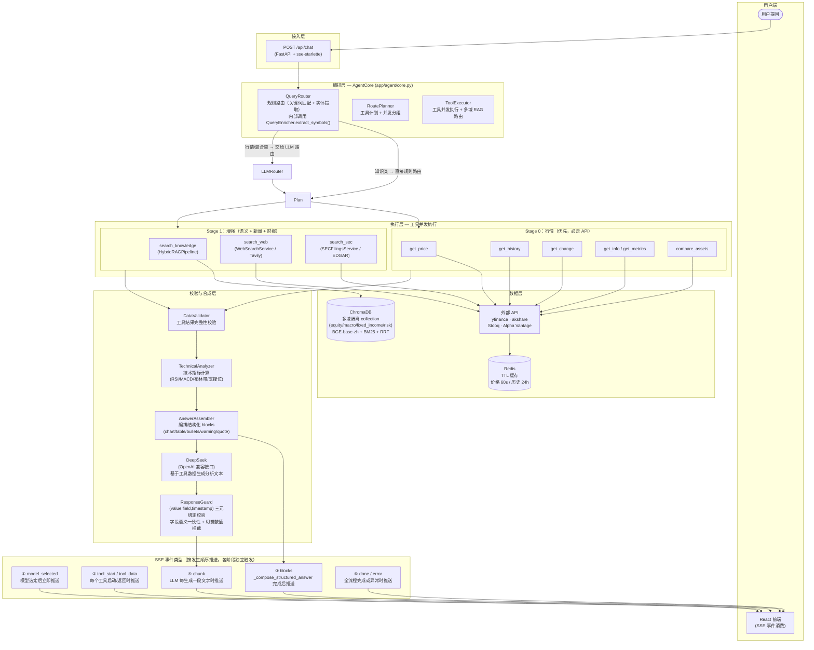

# 华尔街见闻：金融资产智能问答系统 (Financial Asset QA System)

> **本项目为"华尔街见闻"全栈金融 AI 挑战赛交付产物。**
> 核心设计理念：**"系统为骨，数据为血，AI为脑"**——将大模型从"全能的生成器"重塑为"克制的分析引擎"，在确保金融级数据准确性的前提下，提供专业、流畅的投研问答体验。

---

## 一、系统架构图 (System Architecture)

### 1.1 架构总览

本系统的最核心架构决策是：**拒绝黑盒 Agent 模式，采用确定性多阶段流水线**。

在通用 AI 应用中，将用户问题直接交给「LLM + 工具调用」是常见做法。但金融场景有两个不可妥协的要求：**数值不能编造、数据来源必须可追溯**。为此，我们将整个请求链路拆解为五个显式阶段——接入、编排、执行、校验与合成——每一步都可以独立审计和降级。



### 1.2 分层说明

| 层级 | 职责 | 核心组件 | 对应代码 |
|------|------|----------|----------|
| **接入层** | 接收 HTTP 请求，以 SSE 协议向前端推送事件流 | FastAPI、sse-starlette | `app/api/routes.py` |
| **编排层** | 意图分类、实体提取、工具选择、并发分组 | QueryRouter（内含 QueryEnricher.extract_symbols）、RoutePlanner、AgentCore | `app/agent/core.py`、`app/routing/`、`app/enricher/` |
| **执行层** | 并发调用外部工具，Stage 0（行情）优先于 Stage 1（增强）；多域 RAG 路由 | ToolExecutor、MarketDataService、MultiDomainRAGPipeline、WebSearchService、SECFilingsService | `app/agent/tool_executor.py`、`app/market/`、`app/rag/`、`app/search/` |
| **数据层** | 行情缓存（Redis）、多域知识库（ChromaDB）、外部 API | Redis、ChromaDB（equity/macro/fixed_income/risk 四域隔离 collection）、yfinance、akshare | `app/cache/`、`app/rag/pipeline.py` |
| **校验与合成层** | 数据校验 → 技术指标计算 → blocks 编排 → LLM 文本生成 → 语义三元绑定校验 | DataValidator、TechnicalAnalyzer、AnswerAssembler、DeepSeek、ResponseGuard | `app/analysis/`、`app/agent/answer_assembler.py`、`app/agent/core.py` |

### 1.3 请求完整生命周期

```
① 用户提问
      ↓
② QueryRouter.classify_async()：
   - 内部调用 QueryEnricher.extract_symbols() 提取 ticker 符号
   - 通过 CHINESE_ALIAS_MAP + TickerMapper.normalize() 完成中文映射（苹果→AAPL）
   - 关键词匹配确定 QueryType（MARKET / KNOWLEDGE / NEWS / HYBRID）
   - refuses_advice 检测：含「买入/推荐/目标价」→ 路由层直接拒答
      ↓
③ 路由决策：
   - 纯知识类（无 ticker，QueryType.KNOWLEDGE） → 规则路由，强制走 search_knowledge
   - 行情/混合类                                → QueryRouter 确定工具类型 + 参数，RoutePlanner 编排执行计划
      ↓
④ RoutePlanner._build_tool_plan：将工具按依赖关系编排为 Stage 0（行情）/ Stage 1（增强）两批
      ↓
⑤ 并发执行 Stage 0（行情工具）→ 推送 tool_start / tool_data 事件
      ↓
⑥ 并发执行 Stage 1（增强工具）→ 推送 tool_start / tool_data 事件
      ↓
⑦ DataValidator.should_block_response()：
   校验工具结果完整性；不满足最低要求则推送 warning block + done，提前结束
      ↓
⑧ TechnicalAnalyzer.analyze()：
   若 get_history 返回 ≥20 条数据，计算 RSI、MACD、布林带、支撑/压力位等技术指标
      ↓
⑨ AnswerAssembler._compose_answer()：
   将工具数据 + 技术指标编排为结构化 blocks（chart/table/bullets/warning/quote）
   → 推送 blocks 事件（前端秒级渲染图表/表格，无需等待 LLM）
      ↓
⑩ DeepSeek（generator prompt + hard_guardrails）：
   接收 AnswerAssembler 返回的 template_text（工具数据的文本化摘要）+ RAG 文档片段
   仅生成纯文字分析结论，不参与数值计算，不重复已在 blocks 中展示的数字
   → 流式推送 chunk 事件（打字机效果）
      ↓
⑪ ResponseGuard.validate()：
   对 LLM 输出进行 (数值, 字段语义, 时间戳) 三元绑定校验：
   - 提及「市盈率」时 payload 中必须存在 pe_ratio 字段
   - 超过 30% 数字无法溯源至工具 payload 则拦截
   - ≤10 的整数视为序数/计数，豁免校验
      ↓
⑫ done 事件：携带置信度、blocks 快照、路由信息、免责声明
```

**SSE 事件推送顺序**：`model_selected`（启动时）→ `tool_start / tool_data`（工具执行期间，多次）→ `blocks`（blocks 编排完成后）→ `chunk`（LLM 流式输出，多次）→ `done / error`（全流程完成）

> 各事件在对应阶段触发即推送，互不等待；前端据此实现「图表秒现 → 文字渐入」的渐进式渲染体验。

### 1.4 五项核心架构决策

| 决策 | 选择 | 理由 |
|------|------|------|
| **流水线 vs 黑盒 Agent** | 确定性多阶段 DAG | 金融场景数值必须可追溯，LangChain 等框架对数据流控制不足，无法保证「行情必走 API」的硬约束 |
| **数据与排版分离** | blocks 事件早于 chunk 事件推送 | 客观数据由 `AnswerAssembler` 编排为原生 blocks 组件（chart/table/bullets），LLM 只负责写文字结论，不重复数字；彻底杜绝 Markdown 表格错乱，前端秒级出图 |
| **双路由策略** | 规则路由 + LLM 路由 | 规则路由保证行情类 100% 走 API（不依赖 LLM 判断）；LLM 路由处理模糊意图；降级时规则路由兜底 |
| **双重反幻觉** | DataValidator + ResponseGuard | DataValidator 校验「有数可答」；ResponseGuard 通过 (数值, 字段语义, 时间戳) 三元绑定校验「数值来自工具且字段语义一致」，防止单位混淆（100 USD vs 100 亿）和字段错位；从输入和输出两端封堵幻觉 |
| **降级保护** | Degraded Mode | LLM 不可用时直接输出 blocks 与原文，前端永不白屏 |

---

## 二、技术选型说明 (Technical Stack & Design Rationale)

金融级问答系统对**数据准确性**和**可追溯性**的要求远高于通用对话。本节逐项说明选型理由与未选方案考量。

### 技术栈速览

| 层级 | 核心选型 | 备选/扩展 |
|------|----------|-----------|
| 前端 | React 18 · Vite 5 · Recharts · Tailwind | — |
| 后端 | FastAPI · Uvicorn · sse-starlette · Pydantic · Python 3.11 | httpx |
| LLM | DeepSeek (OpenAI 兼容) | 可切换 GPT-4o / Claude |
| 向量检索 | ChromaDB · BGE-base-zh · BM25 · RRF | HyDE · Multi-Query · Reranker |
| 行情数据 | yfinance · akshare | Stooq · Alpha Vantage |
| 增强数据 | Tavily · SEC EDGAR | MinerU (文档解析) |
| 缓存 | Redis | 内存 fallback |
| Prompt | prompts.yaml 集中管理 | 路由 / 生成 / 合规 三套模板 |

---

### 2.1 Agent 与 Pipeline 核心

| 选型 | 选择 | 理由 | 未选方案 |
|------|------|------|----------|
| **Pipeline 范式** | 确定性多阶段 DAG | 金融场景容错率极低。将用户问题直接交给 LLM + 工具调用，无法保证数据来源可追溯、数值不被篡改。我们采用「路由 → 数据获取 → 校验 → 合成」的显式流水线，每一步都可审计、可降级。 | **LangChain / LlamaIndex**：抽象过重，对数据流控制不足，难以保证「行情必走 API」的硬约束。 |
| **路由策略** | 规则路由 + LLM 辅助 | 规则路由（关键词、实体抽取）保证行情类问题 100% 走 API；LLM 路由作为补充，处理模糊意图。避免纯 LLM 路由的延迟与不确定性。 | 纯 LLM 路由：延迟高、存在误判，且无法在无 LLM 时降级。 |
| **LLM 角色** | 仅负责「语言合成」，不参与数据计算 | 涨跌幅、波动率、最大回撤等均由后端计算，LLM 只基于给定上下文生成分析文本。从源头杜绝数值幻觉。 | 让 LLM 自行计算：易产生数值幻觉，金融场景不可接受。 |
| **LLM 选型** | DeepSeek | 成本可控（约 GPT-4 的 1/10）、中文能力强、OpenAI 兼容接口便于迁移。在金融术语理解和合规拒答上表现稳定。 | **GPT-4o**：效果略优但成本高；**Claude**：同理。当前阶段以 DeepSeek 为主，后续可做 A/B 对比。 |
| **Model Adapter** | 抽象层 + DeepSeek 实现 | 通过 OpenAI 兼容接口调用。Adapter 抽象便于后续切换 GPT-4o、Claude，仅改配置即可，无需改业务逻辑。 | 直接写死调用：切换模型需改多处代码，不利于 A/B 测试。 |
| **反幻觉机制** | DataValidator + ResponseGuard | **DataValidator**：校验工具返回是否满足最低要求（如无价格则拒答）；**ResponseGuard**：通过 (数值, 字段语义, 时间戳) 三元绑定校验 LLM 输出，防止单位混淆和字段错位，超过 30% 数字无法溯源则拦截。 | 纯 LLM 自检：不可靠；外部 Guardrails API：增加延迟与依赖。 |
| **Prompt 管理** | prompts.yaml 集中管理 | 路由、生成、合规三套 Prompt 统一放在 `prompts.yaml`，通过 `get_prompt(section, name)` 加载。便于版本管理和合规审计，避免硬编码散落。 | 代码内硬编码：难以维护和审计。 |

---

### 2.2 RAG 检索链路

| 选型 | 选择 | 理由 | 未选方案 |
|------|------|------|----------|
| **向量库** | ChromaDB | 轻量、可本地持久化、Python 原生，无需额外服务。与 sentence-transformers 生态无缝集成，适合单机或小规模部署。 | **Pinecone**：托管服务，有网络与成本依赖；**Weaviate**：功能强但部署复杂。 |
| **Embedding 模型** | BAAI/bge-base-zh-v1.5 | 中文金融语料上表现优异，768 维在精度与推理速度间取得平衡。对「市盈率」「市净率」等专业术语的语义捕捉优于通用多语言模型。FlagEmbedding 同时提供 Reranker 支持。 | bge-large：效果略好但推理更慢；text-embedding-ada：英文优、中文弱，且需 API 调用。 |
| **检索策略** | 向量 + BM25 + RRF 融合 | 纯向量易漏精确匹配（如「PE 公式」）；纯 BM25 对同义表达不敏感。RRF (Reciprocal Rank Fusion) 将两者排序融合，兼顾语义与关键词，显著提升金融定义类问题的召回率。 | 纯向量：召回不全；纯 BM25：语义理解弱。 |
| **查询改写** | HyDE + Multi-Query | **HyDE**：用 LLM 生成假设性答案文档，以其 embedding 检索，提升语义召回；**Multi-Query**：将用户问题扩展为 3 个变体查询，多路检索后取并集。 | 无改写：短查询易召回不全。 |
| **中文分词** | jieba | BM25 需要分词。jieba 对金融术语有较好切分效果，且无额外服务依赖。 | HanLP / pkuseg：需额外依赖，jieba 足够轻量。 |
| **Chunk 策略** | 按段落 + 语义边界 | 金融文档有明确章节结构。按标题切分保留完整语境，chunk_size 约 600 token，overlap 120。 | 固定长度切分：易切断语义单元。 |
| **Reranker** | BAAI/bge-reranker-base | 向量初筛后，用 Cross-Encoder 对 Top-K 做精排。仅对少量候选调用，成本可控。 | 无 Reranker：精排靠 RRF 已可接受；Cohere Rerank：需 API 调用与成本。 |

---

### 2.3 市场数据源

| 选型 | 选择 | 理由 | 未选方案 |
|------|------|------|----------|
| **主数据源** | yfinance | 覆盖美股、港股、ETF，免费、稳定，无需 API Key，降低部署门槛。 | 付费 API（如 Bloomberg）：成本高、需商务对接；自建爬虫：合规与维护风险。 |
| **A 股** | akshare | 国内行情数据最全的开源库，支持 A 股实时与历史。与 yfinance 互补，覆盖全球主要市场。 | Tushare：部分数据需积分；东方财富接口：非官方、稳定性依赖爬虫。 |
| **备用链** | Stooq → Alpha Vantage | yfinance 偶发超时或限流时的多级 fallback，保证行情类问题「有数据可答」。 | 单数据源：一旦限流或宕机，行情类问题无法回答。 |
| **缓存** | Redis | 价格 TTL 60s、历史 TTL 24h，精确过期、重启不丢、便于监控。多实例部署时共享缓存，避免不一致。 | 纯内存：无 TTL、多实例不共享；Memcached：功能相当，但 Redis 生态更丰富。 |

---

### 2.4 外部增强数据

| 选型 | 选择 | 理由 | 未选方案 |
|------|------|------|----------|
| **Web 搜索** | Tavily API | 面向 AI 的搜索 API，支持 `include_domains` 白名单（bloomberg、reuters、cnbc），确保新闻来源可信。 | 自建爬虫：合规与维护成本高；Google Custom Search：配额与定价不友好。 |
| **SEC 财报** | SEC EDGAR 官方 API | 免费、权威。通过 company_tickers 解析 CIK，查 submissions 获取 10-K/10-Q。 | 第三方财报 API：有成本；自建解析：SEC 格式复杂，维护成本高。 |
| **文档解析** | MinerU API | PDF/Word 转 Markdown，支持表格、公式，适合金融教材与研报结构化入库。 | PyMuPDF / pdfplumber：表格与公式支持弱；商业 OCR：成本高。 |

---

### 2.5 前端与交互

| 选型 | 选择 | 理由 | 未选方案 |
|------|------|------|----------|
| **框架** | React 18 + Vite 5 | React 生态成熟，Vite 冷启动与 HMR 快。Vite proxy 将 `/api` 转发到后端，前后端分离清晰。 | Next.js：SSR 对本场景无刚需；Webpack：Vite 更轻更快。 |
| **图表** | Recharts | 纯 React 组件，与现有技术栈一致，支持折线图、面积图，满足价格走势展示。 | ECharts：包体大、非 React 原生；Chart.js：配置相对繁琐。 |
| **流式输出** | SSE (Server-Sent Events) | 单向推送，比 WebSocket 实现简单、防火墙友好、自动重连。先推送 `blocks` 渲染卡片，再推送文本，用户感知延迟低。 | WebSocket：需维护连接状态，本场景无双向需求。 |
| **样式** | Tailwind CSS | 原子类避免全局样式污染，约束有助于保持金融界面的清晰与一致性。 | CSS-in-JS：运行时开销；传统 CSS：全局污染、维护成本高。 |

---

### 2.6 后端与部署

| 选型 | 选择 | 理由 | 未选方案 |
|------|------|------|----------|
| **Web 框架** | FastAPI + Uvicorn | 原生 async、自动 OpenAPI 文档、Pydantic 集成。Uvicorn 支持 SSE 长连接。 | Flask：非原生 async；Django：过重。 |
| **流式协议** | sse-starlette | 基于 Starlette 的 SSE 实现，与 FastAPI 同源，支持长连接、自动心跳、优雅断开。 | 手动拼接 EventStream：易出错；WebSocket：本场景无双向需求。 |
| **HTTP 客户端** | httpx | 异步 HTTP，与 FastAPI 的 async 模型一致。用于调用 Tavily、SEC、MinerU 等外部 API。 | requests：同步阻塞；aiohttp：API 不如 httpx 简洁。 |
| **Python 版本** | 3.11 | async/await 成熟、类型提示完善、性能优化，与 FastAPI、Pydantic 生态兼容良好。 | 3.12：部分依赖尚未完全适配。 |
| **容器化** | Docker Compose | 一键启动 backend + frontend + Redis，部署或演示时无需手动配环境。 | K8s：本场景过度；单 Dockerfile：Compose 便于多服务编排。 |
| **配置** | pydantic-settings + .env | 敏感信息不入库，通过环境变量注入，支持多环境切换，类型安全。 | 硬编码 / 多配置文件：难以维护。 |

---

## 三、Prompt 设计思路 (Prompt Design)

Prompt 是 LLM 参与决策的唯一入口。本章说明其在流水线中的层级位置、每套 Prompt 的职责，以及关键设计决策。

### 3.1 Prompt 在架构中的位置

```
用户提问
    │
    ▼
┌──────────────────────────────────────────────────────┐
│ 路由层（LLMQueryRouter）                              │
│ Prompt：router system_prompt + user_template         │
│ 职责：将问题分类为 4 种类型，通过 function calling     │
│       选择工具（API / RAG / 混合）及其参数             │
│ 代码：app/routing/llm_router.py                      │
└──────────────────────────────────────────────────────┘
    │ 规则路由（知识类）直接跳过此层
    ▼
┌──────────────────────────────────────────────────────┐
│ 执行层（工具并发调用）                                │
│ Prompt：无                                           │
│ 职责：并发调用 get_price、search_knowledge、          │
│       search_web 等工具，返回纯数据                   │
└──────────────────────────────────────────────────────┘
    │
    ▼
┌──────────────────────────────────────────────────────┐
│ 合成层（AgentCore Synthesis）                         │
│ Prompt：generator system_prompt + hard_guardrails     │
│       + user_template（含工具数据注入）               │
│ 职责：基于工具返回的客观数据，生成结构化分析文本        │
│ 代码：app/agent/core.py                              │
└──────────────────────────────────────────────────────┘
```

**结论**：Prompt 仅作用于**路由层**与**合成层**，执行层为纯工具调用，不涉及 LLM。

### 3.2 Router Prompt：意图分类与路由决策

Router 是流水线的第一个 LLM 调用点，负责将用户问题分类为 4 种意图，并映射到 5 条路由路径。

**4 种意图类型**（`question_type` 字段，定义于 `prompts.yaml`）：

| 意图类型 | 含义 | 典型示例 |
|---------|------|---------|
| `real_time_quote` | 实时价格、涨跌幅、成交量等行情数据 | "AAPL今天涨了多少？" |
| `financial_knowledge` | 金融概念、术语、指标原理 | "什么是市盈率？" |
| `company_analysis` | 公司财报、业绩、事件驱动分析 | "微软上季度营收驱动力是什么？" |
| `comparison` | 多资产、多指标或跨时段对比 | "AAPL 和 MSFT 今年表现对比" |

**5 条路由路径**（`route` 字段）：

| 路由 | 触发条件 | 工具链 |
|------|---------|--------|
| `api_direct` | `real_time_quote` | 仅调用市场数据 API |
| `rag_retrieval` | `financial_knowledge` | 仅检索本地知识库 |
| `hybrid` | `company_analysis` / `comparison` | API + RAG 并发 |
| `clarify` | `confidence < 0.7` | 不猜测，向用户反问澄清 |
| `compliance_block` | 含"建议买/卖"、"推荐"等投资建议词 | 路由层直接拒答，不进入执行层 |

**Router 输出 Schema**（完整 JSON 结构）：

```json
{
  "question_type": "real_time_quote",
  "confidence": 0.92,
  "route": "api_direct",
  "entities": {
    "ticker": "AAPL",
    "company": "苹果",
    "time_range": "1d"
  },
  "reasoning": "用户询问实时价格，ticker 明确为 AAPL"
}
```

同时，router 还通过 **function calling** 选择具体工具及其参数（如 `get_stock_price(symbol="AAPL", time_range="1d")`），LLM 的工具调用结果与上述 JSON 共同构成路由决策。

---

### 3.3 Generator Prompt：合成层的语言生成

Generator 是流水线中唯一负责「写文字」的 LLM 调用，基于工具返回的客观数据生成结构化分析文本。

**强制输出模板**（`prompts.yaml` 中硬性定义，不可绕过）：

```
## [问题标题]

### 📝 智能分析
[基于数据的客观分析，2-4 句话，不含主观投资判断。
 直接给出结论，不重复列举具体数字（前端已渲染数据卡片）。]

### 💡 相关问题
- [推荐追问 1]
- [推荐追问 2]

---
⚠️ 免责声明：本回答仅供信息参考，不构成投资建议。
```

**设计意图**：「智能分析」区只写文字结论，不写数字表格——数字已在 `blocks` 事件中以原生图表/表格卡片展示。这是「数据与排版分离」架构决策在 Prompt 层的直接体现：LLM 从物理上无法重复输出已在前端渲染的数值，消除了一类幻觉来源。

### 3.4 设计要点

| 维度 | 实现 |
|------|------|
| **集中管理** | `prompts.yaml` 统一存储，`get_prompt(section, name)` 加载，变更有迹可查，便于合规审计 |
| **分层职责** | Router 负责「选什么工具」，Generator 负责「如何表述」；数值计算完全由工具完成，LLM 不参与 |
| **反幻觉（输入端）** | Generator 明确要求「只使用提供的数据」；置信度字段（`api_completeness`、`rag_relevance`）注入上下文，LLM 可感知数据质量 |
| **反幻觉（输出端）** | 代码追加 `hard_guardrails`（100% 基于上下文、禁止预测推测）+ ResponseGuard 事后数值溯源校验 |
| **合规（路由前置）** | Router `compliance_block` 路由在进入执行层前直接拒答投资建议类问题 |
| **合规（生成后置）** | Generator 内置合规拒答模板；`compliance` 审查器已设计完备（见 3.5），可接入为后置中间件 |
| **语言约束** | Generator 明确禁止英文小节标题（如 Analysis、KEY POINTS），并映射术语（USD → 美元） |

### 3.5 变量注入与 Prompt 组合

**Router** 输入变量：`{user_question}`

**Generator** 输入变量：

| 变量 | 来源 | 说明 |
|------|------|------|
| `{user_question}` | 原始问题 | 用户输入 |
| `{api_data}` | Stage 0 工具结果 | 行情、财报数据的文本化表示 |
| `{rag_context}` | Stage 1 RAG 检索 | Top-K 相关文档片段，按相关度排序 |
| `{api_completeness}` | DataValidator 评分 | 0~1，反映行情数据完整程度 |
| `{rag_relevance}` | RAG 检索评分 | 0~1，反映知识库召回相关程度 |

**hard_guardrails**（代码注入，`app/agent/core.py`，追加至 system_prompt 末尾）：

```python
hard_guardrails = """绝对禁令（Guardrails）：
1. 你的回答必须100%基于用户提供的上下文数据，不允许引入任何外部未提供的数值或事实。
2. 禁止预测未来走势、买卖推荐、目标价等投资建议。
3. 若数据不足，必须明确说明"缺乏足够数据支撑"，不要推测或估算。
4. 必须使用简体中文回答，并在末尾强调免责声明。
5. 禁止使用英文作为小节标题或术语。"""
system_prompt = base_system_prompt.strip() + "\n\n" + hard_guardrails
```

**最终 system_prompt 结构** = `prompts.yaml[generator.system_prompt]` + `hard_guardrails`，两层叠加：前者定义「如何回答」，后者定义「绝对不能做什么」。

### 3.6 Compliance 审查器：设计完备，待激活

`prompts.yaml` 中已完整定义 `compliance` 模块，作为**后置合规审查中间件**的完整设计，但当前版本中尚未接入主流程（合规任务由 generator 内置模板 + hard_guardrails 承担）。

**Compliance Prompt 的 4 条审查规则**：

| 规则 | 内容 | 触发示例 |
|------|------|---------|
| `rule_1` 投资建议禁止 | 禁止「建议买/卖/持有」「预计上涨/下跌」「目标价」「推荐配置」 | "建议买入 AAPL" |
| `rule_2` 数据编造禁止 | 禁止引用上下文未提供的具体数字；禁止对缺失数据推断填充 | 凭空生成营收数字 |
| `rule_3` 敏感内容禁止 | 禁止涉及内幕交易、市场操纵、非法集资、逃税避税操作 | "如何规避资本利得税" |
| `rule_4` 免责声明必须 | 任何含数据分析的回答必须附带免责声明，缺失即违规 | 缺少⚠️免责声明 |

**Compliance 输出 Schema**：

```json
{
  "is_compliant": false,
  "risk_level": "high",
  "violations": [
    {
      "rule_id": "rule_1",
      "violation_detail": "建议买入 AAPL，目标价 $220",
      "suggested_action": "replace"
    }
  ],
  "action": "block",
  "safe_fallback": "本系统仅提供历史数据与客观分析，无法提供投资建议或价格预测。"
}
```

**激活路径**：在 `app/agent/core.py` 合成完成后，插入一次 compliance LLM 调用，根据 `action` 字段决定是直接推送（pass）、替换局部文字（replace）还是整体拦截（block）。接入改动极小，代码框架已完备。

---

## 四、数据来源说明 (Data Sources)

系统数据按功能分为五大类：**本地静态知识库、实时行情数据、新闻与资讯、财报与监管文件、文档解析入库**。各类数据在请求流水线的不同阶段被并发调用，由 DataValidator 统一校验后注入 LLM 合成层。

---

### 4.1 本地静态知识库（RAG 向量知识库）

**目录**：`backend/data/knowledge/`（按域隔离的 Markdown 文件，支持多域 RAG 路由）

这是系统 RAG 检索的核心语料库，由人工整理的结构化金融知识文档构成，经 MinerU 解析 / 直接编写后写入向量库。知识库按域物理隔离，`DomainRouter` 根据查询意图路由到对应域，防止跨域知识干扰。

| 域 | 目录 | 文件 | 内容摘要 |
|------|------|------|----------|
| **equity** | `equity/` | `股票基础.md` | A股/港股/美股交易规则、涨跌停板、T+0/T+1、融资融券、股票质押 |
| **equity** | `equity/` | `core_finance_metrics.md` | PE、PB、EPS、PEG、ROE、EV/EBITDA、FCF 等核心估值指标定义与公式 |
| **macro** | `macro/` | `macro_economics.md` | GDP、CPI、利率、汇率、货币政策对市场的传导机制、经济周期 |
| **fixed_income** | `fixed_income/` | `bonds_basics.md` | 债券定价、久期、信用评级、收益率曲线、固收投资策略 |
| **risk** | `risk/` | `risk_management.md` | VaR、最大回撤、夏普比率、凯利公式、对冲策略、仓位管理 |

**检索方式**：向量检索（BGE-base-zh-v1.5）+ BM25 + RRF 融合 → BGE-reranker-base 精排 → Top-K 片段注入 generator prompt。

---

### 4.2 实时行情数据（多级 Fallback 机制）

**工具**：`get_price`、`get_history`、`get_change`、`get_info`、`get_metrics`、`compare_assets`

系统按资产类型分配主数据源，并构建三级 fallback 链，确保行情类问题「必有数据可答」：

| 数据源 | 覆盖资产 | 优先级 | 用途 | 限制 |
|--------|----------|--------|------|------|
| **yfinance** | 美股、港股、ETF、全球指数、加密货币、大宗商品 | 主（美股/港股/ETF） | 实时报价、历史 OHLCV | 偶发限流 |
| **akshare** | A股（沪深）、港股 | 主（A股） | A股实时价格与历史数据 | 依赖国内网络 |
| **Stooq** | 美股、美债、欧洲股市 | 备用（yfinance 失败） | 免费 CSV 历史数据 | 无实时盘中 |
| **Alpha Vantage** | 美股、全球股市 | 兜底 | 行情报价、公司概况（Overview） | 25次/天（免费） |
| **Finnhub** | 美股 | 行情辅助（市场概览） | 快速报价（市场概览页轮询） | 60次/分钟（免费） |

**Fallback 逻辑**（代码位置：`app/market/service.py`）：

```
A股：akshare → yfinance → Stooq → Alpha Vantage
美股/港股/ETF：yfinance → Stooq → Alpha Vantage
市场概览：Finnhub（并发拉取所有指数/板块）
```

**缓存策略**（Redis，无 Redis 时降级为内存缓存）：

| 数据类型 | TTL | 说明 |
|----------|-----|------|
| 实时价格 | 60 秒 | 平衡实时性与 API 配额 |
| 历史行情 | 24 小时 | 历史数据不频繁变化 |
| 公司信息 | 7 天 | 基本面数据变化慢 |

---

### 4.3 新闻与资讯数据

**工具**：`search_web`（`app/search/service.py`）

| 数据源 | 用途 | 参数配置 |
|--------|------|----------|
| **Tavily API** | 事件驱动分析（为什么涨/跌、宏观事件解读） | `search_depth=advanced`、`topic=news`、`days=7`、白名单域名 10 个 |
| **NewsAPI (newsapi.org)** | 个股新闻聚合（近期报道） | 关键词匹配个股代码，近 7 天，按发布时间排序 |
| **Finnhub News** | 个股资讯（与行情数据同源拉取） | 按日期范围获取，与 NewsAPI 合并去重后返回 |

**Tavily 白名单域名**（高信号金融媒体）：

```
bloomberg.com · reuters.com · cnbc.com · wsj.com · finance.yahoo.com
ft.com · barrons.com · investopedia.com · seekingalpha.com · marketwatch.com
```

新闻数据用于回答「某资产近期为何异动」类问题，不参与数值计算，仅作为背景事件证据注入 generator prompt。

---

### 4.4 财报与监管文件

**工具**：`search_sec`（`app/search/sec.py`）

| 数据源 | 接入方式 | 覆盖范围 | 用途 |
|--------|----------|----------|------|
| **SEC EDGAR 官方 API** | `https://www.sec.gov/files/company_tickers.json` → CIK 查找 → `/submissions/{CIK}.json` | 美股上市公司 10-K / 10-Q | 公司年报、季报摘要；业绩驱动分析 |

SEC 数据获取流程：
```
① 通过 company_tickers.json 将 ticker 映射为 CIK
② 请求 submissions/{CIK_padded}.json 获取最新财报列表
③ 抓取 10-K / 10-Q 文件链接，返回文件摘要
```

无需 API Key，免费接入，数据权威可信（直接来源于美国证监会官网）。

---

### 4.5 文档解析入库与数据清洗

#### 4.5.1 整体入库流程

知识库文档的入库分两条路径，由 `MinerUDocumentIngestor`（`app/rag/mineru_ingestion.py`）统一调度：

```
原始文档（PDF / Word / PPT / 图片）
        │
        ▼
┌─────────────────────────────────────────────┐
│  路径 A：二进制文档（.pdf / .doc / .ppt 等） │
│  → MinerU API 解析 → ZIP 下载 → 提取 .md    │
└─────────────────────────────────────────────┘
        │
        ▼
┌──────────────────────────────────────────────┐
│  路径 B：本地文本（.md / .html）              │
│  → HTML：正则剥离 <script>/<style>/标签       │
│  → Markdown：直接进入清洗                    │
└──────────────────────────────────────────────┘
        │
        ▼
┌──────────────────────────────────────────────┐
│  clean_markdown()（统一文本规范化）           │
│  ① 统一换行符 \r\n → \n                     │
│  ② 压缩连续空行（3+ → 2）                   │
│  ③ 清除行尾/行首多余空格                     │
│  ④ 规范化分隔线（---/___  → 双空行）         │
│  ⑤ 压缩连续空格（2+ → 1）                   │
│  ⑥ 删除空标题（## + 空行 → 移除）           │
└──────────────────────────────────────────────┘
        │
        ▼
写入 backend/data/knowledge/  →  RAG 自动索引入库
```

**清洗目的**：消除 OCR / 格式转换引入的冗余换行、乱码空格和无意义分隔线，确保 Chunk 切分时语义完整，不被噪声切断。

---

#### 4.5.2 为什么选择 MinerU？

本项目使用 MinerU（`https://mineru.net`）作为文档解析主引擎，核心配置：

| 配置项 | 值 | 含义 |
|--------|----|------|
| `MINERU_ENABLE_TABLE` | `True` | 保留表格结构（Markdown 表格） |
| `MINERU_ENABLE_FORMULA` | `True` | 识别数学公式（LaTeX/文本） |
| `MINERU_OCR_BY_DEFAULT` | `True` | 扫描件默认 OCR |
| `MINERU_LANGUAGE` | `ch` | 中文优先识别 |
| `MINERU_MODEL_VERSION` | `pipeline` | 完整解析流水线（版式分析 + OCR + 表格重建） |

**选择 MinerU 的具体理由：**

1. **输出即 Markdown，RAG 直接可用**：MinerU 的核心竞争力不是"识别文字"，而是"重建文档结构"。输出的 Markdown 保留了标题层级、表格、代码块，无需二次结构化即可送入 Chunk 切分，极大降低了 RAG 入库的后处理成本。

2. **金融文档有大量表格与公式**：财务三表、估值模型、技术指标公式在普通 OCR 下会被识别为乱序文本，MinerU 专门训练了版式分析模型，能正确重建多列表格和 LaTeX 公式。

3. **支持多格式批量处理**：单次 API 调用最多上传 20 个文件，支持 PDF / DOC / DOCX / PPT / PPTX / 图片，覆盖金融研报的所有常见格式。

4. **云端 API，零本地 GPU 依赖**：本项目后端是 Python + FastAPI，运行在 CPU 环境。MinerU 作为 SaaS API 调用，无需在本地部署任何模型，与项目的无 GPU 部署目标完全一致。

5. **已有成熟的 Python 封装**：`mineru_client.py` 实现了"上传 → 轮询 → 下载 ZIP → 提取 Markdown"的完整闭环，错误处理（超时、批量 ID、状态轮询）均已覆盖，接入成本低。

---

#### 4.5.3 文档解析工具深度对比：MinerU vs DeepSeek OCR vs 百度飞桨 PaddleOCR

金融文档解析有三类主流技术路线，各有明确的适用场景：

| 对比维度 | **MinerU API** | **DeepSeek-VL2 视觉模型** | **百度飞桨 PaddleOCR** |
|----------|---------------|--------------------------|----------------------|
| **技术路线** | 版式分析 + 专用 OCR + 结构重建流水线 | 多模态大语言模型（图像理解 + 文本生成） | 经典深度学习 OCR（检测 + 识别双阶段） |
| **输出格式** | 结构化 Markdown（含表格、标题层级、公式） | 纯文本 / 自定义格式（需 Prompt 引导） | 纯文本（无结构，仅文字） |
| **表格识别** | ✅ 专项训练，跨列合并/多表格均可 | ⚠️ 依赖模型理解，复杂嵌套表格偶有漏列 | ❌ 需额外 PP-Structure 插件，效果一般 |
| **公式识别** | ✅ LaTeX 输出，金融公式准确 | ✅ 理解能力强，但输出格式不固定 | ❌ 仅识别为文字符号，无结构 |
| **中文金融术语** | ✅ 专项语料训练 | ✅ 预训练语料极广，术语覆盖全 | ✅ 百度金融语料加强，中文识别准确率高 |
| **扫描件/图片** | ✅ 内置 OCR，`is_ocr=True` 自动触发 | ✅ 原生图像输入 | ✅ 最核心能力，速度最快 |
| **部署方式** | 云端 SaaS API（需 Token） | 云端 API / 本地部署（需 GPU 80GB+） | 本地部署（可 CPU 运行） |
| **GPU 依赖** | ❌ 无（纯 API 调用） | ✅ 本地部署需 A100 级 GPU | ⚠️ CPU 可运行，GPU 加速可选 |
| **RAG 友好度** | ⭐⭐⭐⭐⭐（直接可用） | ⭐⭐⭐（需后处理结构化） | ⭐⭐（纯文本，需大量后处理） |
| **处理速度** | ⭐⭐⭐（云端异步，5~15 分钟/批） | ⭐⭐（推理慢，每页 5~30s） | ⭐⭐⭐⭐⭐（本地极快，毫秒级/页） |
| **成本** | 按调用量（API Token 收费） | 按 Token 收费（图像 Token 贵） | 开源免费，仅服务器成本 |
| **批量处理** | ✅ 最多 20 文件/批，异步轮询 | ❌ 逐图调用，无批量 | ✅ 支持目录批量，速度极快 |
| **典型适用场景** | 金融研报、财务年报、教材入库 | 复杂版式理解、半结构化 | 大批量扫描件、票据、证件 |

---

#### 4.5.4 不同场景下的选型建议

**场景 1：金融研报 / 财务年报 → 推荐 MinerU**

研报的核心价值在于图表、表格和层级结构（如「第三章 盈利能力分析 → 3.1 净利率 → 表 3-1」）。普通 OCR 识别后表格变成乱序文字，RAG 几乎无法正确检索。MinerU 输出的 Markdown 表格与标题层级可直接用于语义切分，是本场景的唯一合理选择。

**场景 2：扫描件票据、大批量图片文字提取 → 推荐 PaddleOCR（百度飞桨）**

PaddleOCR 在纯文字识别速度上是三者中最快的，CPU 即可运行，无需外部 API，适合处理大量扫描票据、合同正文等只需提取文字而不需要结构的场景。如果只是把 500 页的招股说明书的正文文字提取出来做关键词搜索，PaddleOCR 的成本最低。

```python
# PaddleOCR 典型调用示例（本地无 GPU）
from paddleocr import PaddleOCR
ocr = PaddleOCR(use_angle_cls=True, lang='ch', use_gpu=False)
result = ocr.ocr('report.png', cls=True)
text = '\n'.join([line[1][0] for line in result[0]])
```

**场景 3：复杂语义理解、混合图文分析 → 考虑 DeepSeek-VL2**

DeepSeek-VL2 的优势不在速度，而在语义推理。当文档内容需要"理解"而不仅仅是"识别"时（如「根据这张 K 线图判断目前的技术形态」），视觉大模型能给出有意义的描述，而传统 OCR 只能输出图表上的数字。但这需要调用昂贵的图像 Token，且输出格式不固定，不适合大批量标准化入库。

```python
# DeepSeek-VL2 视觉模型典型调用（API 方式）
import base64, httpx
with open("chart.png", "rb") as f:
    img_b64 = base64.b64encode(f.read()).decode()

response = httpx.post("https://api.deepseek.com/chat/completions", json={
    "model": "deepseek-vl2",
    "messages": [{
        "role": "user",
        "content": [
            {"type": "image_url", "image_url": {"url": f"data:image/png;base64,{img_b64}"}},
            {"type": "text", "text": "请提取这张财务报表的所有数据，输出为 Markdown 表格"}
        ]
    }]
})
```

**三种工具定位总结：**

```
MinerU          → 文档结构重建专家（研报 / 教材入库的最优解）
PaddleOCR       → 文字提取速度冠军（大批量扫描件，成本最低）
DeepSeek-VL2    → 图文语义理解（需要"读懂"图表而非提取文字）

本项目选择 MinerU 的核心原因：
RAG 质量 = 检索质量 × 文档结构质量
PaddleOCR 出来的纯文字丢失了表格和层级，直接损害 RAG 召回率；
DeepSeek-VL2 每次调用成本高、速度慢、输出不稳定，不适合批量入库；
MinerU 输出结构化 Markdown，clean_markdown() 一轮清洗即可入库，是三者中
RAG 友好度最高的选择。
```

---

### 4.6 数据来源汇总与分类

| 类别 | 数据源 | 时效性 | API Key 要求 | 主流程使用 |
|------|--------|--------|--------------|------------|
| 知识库 | 本地 Markdown 文档（5 个，按域分目录） | 静态 | 无 | ✅ |
| 行情（主） | yfinance | 实时 | 无 | ✅ |
| 行情（A股主） | akshare | 实时 | 无 | ✅ |
| 行情（备用） | Stooq | 日级 | 无 | ✅ fallback |
| 行情（兜底） | Alpha Vantage | 实时 | 可选 | ✅ fallback |
| 行情（辅助） | Finnhub | 实时 | 可选 | ✅ 市场概览 |
| 新闻搜索 | Tavily API | 近 7 天 | 必需 | ✅ |
| 新闻聚合 | NewsAPI | 近 7 天 | 可选 | ✅ 个股新闻 |
| 财报文件 | SEC EDGAR | 季级 | 无 | ✅ |
| 文档解析 | MinerU API | 离线入库 | 可选 | 知识库构建 |
| 缓存层 | Redis | 按 TTL | 无（本地） | ✅ |

### 4.7 多源并发整合流程

混合型问题（如「阿里巴巴最近为何大涨？」）由 AgentCore 并发调用多类工具：

```
① get_price / get_change   → 验证涨跌幅（客观数值基础）
② search_web (Tavily)      → 近 7 天白名单新闻，获取事件诱因
③ search_sec (EDGAR)       → 最新 10-K/10-Q，寻找业绩驱动
④ search_knowledge (RAG)   → 本地知识库，补充相关背景概念

DataValidator 将上述异构数据（JSON 行情、新闻摘要、Markdown 文档片段）
校验完整性后统一格式，一并注入 generator prompt，实现跨源交叉印证。
```

---

## 五、优化与扩展思考 (Optimization & Extension)

> 本章从 MVP 现状出发，系统梳理从「个人演示项目」到「机构级生产系统」的完整升级路径，并结合华尔街见闻的产品特点提出针对性的扩展方向。

---

### 5.1 MVP 的现实局限：哪里最脆弱

当前系统在本地或演示环境运行良好，但在机构生产场景下，以下几个点会是最先崩溃的：

| 问题类别 | 具体表现 | 根因 |
|----------|----------|------|
| **数据源不稳定** | yfinance 在高并发时频繁触发 429 限流；Alpha Vantage 仅 25 次/天免费配额，用完即报错 | 全部依赖免费 API，无 SLA 保障 |
| **行情延迟高** | yfinance 延迟通常 10~30 秒，盘中问「AAPL 现在多少」经常返回 15 分钟前数据 | 免费数据源无实时推流，只有轮询 |
| **新闻质量差** | Tavily 免费版限速；NewsAPI 免费版仅支持历史数据，不支持实时 | 免费层不含实时订阅权限 |
| **知识库覆盖窄** | 5 个 Markdown 文件（equity/macro/fixed_income/risk 四域），约 3 万字，缺乏 A 股研报、宏观数据、行业报告 | 人工整理成本高，没有自动更新机制 |
| **LLM 单点依赖** | 仅接入 DeepSeek 一个模型，若 DeepSeek 宕机整个合成层失效 | 无备用模型 fallback |
| **无持久化会话** | 每次对话独立，不记录上下文，用户无法追问 | 没有实现多轮对话记忆 |
| **无监控告警** | 工具失败、路由误判、LLM 幻觉均无可观测日志 | 缺少 APM 和结构化日志 |

---

### 5.2 数据基础设施升级：从「免费凑合」到「机构级可信」

这是生产化改造中影响最大的一项。免费 API 的核心问题不只是限速，更是**数据质量 SLA 的缺失**——金融机构对行情数据有明确的延迟要求（通常 Level 1 行情 ≤3 秒，Level 2 ≤1 秒）。

#### A. 行情数据升级

| 场景 | MVP（当前） | 生产推荐方案 | 预期改善 |
|------|------------|------------|---------|
| **美股实时行情** | yfinance（轮询，延迟 10~30s） | Bloomberg B-PIPE / Refinitiv Elektron / Polygon.io 付费版 | 延迟降至 <500ms，有 SLA |
| **A 股实时行情** | akshare（爬虫接口，非官方） | 万得（Wind）行情 API / 同花顺 iFinD / 东方财富 Choice | 官方授权，稳定性显著提升 |
| **港股行情** | yfinance（延迟高） | 港交所官方数据授权 / Bloomberg | 实时 Level 1 行情 |
| **期货/期权/债券** | 未覆盖 | Wind 衍生品数据 / CME 官方 API | 覆盖全资产类别 |
| **历史数据** | yfinance + Stooq（有缺失） | Refinitiv / Bloomberg 历史数据 | 完整的 tick 级历史，无缺失 |

**成本估算**（参考）：Bloomberg Terminal 约 $2,000/月/用户；Wind 机构版约 10 万元/年；Polygon.io 基础付费版约 $199/月——对华尔街见闻这类机构，这些都是标准数据采购成本。

#### B. 新闻与资讯升级

当前使用 Tavily + NewsAPI 免费层，有两个核心问题：时效性差（非实时推流）、来源局限（英文为主）。

生产场景下的替代方案：

| 当前 | 升级方案 | 优势 |
|------|----------|------|
| Tavily 免费版 | Tavily 付费版 / Bing News API 企业版 | 无限速、实时索引 |
| NewsAPI 免费版 | Bloomberg News API / Refinitiv News | 实时推送、机构级新闻 |
| 无 A 股中文新闻 | **华尔街见闻自有内容 API** | 直接接入平台自有新闻流，内容质量远高于第三方 |
| 无公告监控 | Wind 公告推送 / 上交所/深交所官方 API | 实时监控重大公告、业绩预告 |

**华尔街见闻的核心优势**：平台本身就是一个优质的中文金融内容生产者，编辑团队每天产出大量分析文章、快讯、深度报道。如果将这些内容实时推入 RAG 知识库，系统对中国市场事件的响应能力会远超任何第三方新闻 API。

#### C. 财报数据升级

当前 SEC EDGAR 仅覆盖美股。A 股财报目前完全未接入。

| 市场 | 当前 | 升级方案 |
|------|------|----------|
| 美股 | SEC EDGAR（免费，官方） | 维持 + XBRL 结构化解析（提取具体财务数字） |
| A 股 | 未覆盖 | 巨潮资讯官方 API / Wind 财务数据 / 同花顺财报接口 |
| 港股 | 未覆盖 | 港交所 HKEx 披露易 API |
| 全球 | 未覆盖 | Refinitiv Fundamentals（全球 70,000+ 公司基本面数据） |

---

### 5.3 知识库的规模化与持续更新

当前 5 个 Markdown 文件（按 equity/macro/fixed_income/risk 四域组织）构成的静态知识库存在明显的覆盖盲区：没有行业研报、没有宏观数据、没有 A 股上市公司的具体信息。生产环境下需要三方面升级：

**① 内容规模化**

```
当前：5 个手写 MD 文件（4 域） ≈ 3 万字
目标：
  - 行业研报：中金、华泰、中信等头部券商公开研报（每月数百篇）
  - 宏观报告：央行货政报告、国家统计局数据解读
  - 公司档案：A 股 5000+ 上市公司基础画像（业务、财务摘要）
  - 华尔街见闻历史文章：平台数年积累的优质分析文章（百万量级）
```

**② 自动更新机制**

静态知识库是 RAG 的生命线，需要建立增量更新 Pipeline：

```
定时任务（每日/每周）
    │
    ▼
新文档发现（爬虫 / API 订阅）
    │
    ▼
MinerU 解析 → clean_markdown() 清洗
    │
    ▼
变更检测（文件 hash 对比，只处理新增/变更文档）
    │
    ▼
向量化 + BM25 增量索引
    │
    ▼
ChromaDB 增量 upsert（不重建全库）
```

**③ 知识库质量评估**

生产中需要对 RAG 检索质量持续监控：

- **召回率监控**：对预设的测试问题集（如「PE 公式」「夏普比率定义」）定期跑评估，追踪 Top-3 召回率
- **相关度分布**：记录每次检索的 `rag_relevance` 分布，低于阈值的 chunk 触发人工审查
- **死角问题库**：收集用户问到但 RAG 未能召回的问题，定向扩充知识库

---

### 5.4 大模型层的生产化

#### A. 多模型 Fallback 与负载均衡

当前单点依赖 DeepSeek 存在可用性风险。生产级 LLM 层应构建以下结构：

```
请求进入合成层
    │
    ▼
主模型：DeepSeek（成本低，中文强）
    │ 失败 / 超时（3s）
    ▼
备用模型：GPT-4o-mini（OpenAI，稳定性高）
    │ 失败 / 超时
    ▼
降级模型：Claude Haiku（Anthropic，轻量，合规文本质量好）
    │ 全部失败
    ▼
Degraded Mode：直接输出 blocks，不做 LLM 合成
```

Model Adapter（`app/routing/router.py`）已抽象了 LLM 接口，仅需扩展 provider 配置即可实现上述链路，代码改动极小。

#### B. Prompt 版本管理与 A/B 测试

当前 `prompts.yaml` 是单版本配置，无法对比不同 Prompt 的效果差异。生产中需要：

- **版本化 Prompt**：每个 Prompt 带版本号，变更时创建新版本而非覆盖
- **A/B 框架**：按用户/请求随机分配 Prompt 版本，记录 response quality score
- **效果指标**：答案完整性、数值准确率（ResponseGuard 校验通过率）、用户追问率（反映满意度）

#### C. 模型微调方向

当前使用通用 DeepSeek，在金融专业场景存在两类不足：
1. **金融实体识别**：中文公司名、债券代码、基金简称的识别准确率低于专业模型
2. **合规拒答边界**：通用模型对「推荐股票」「预测走势」等敏感问题的拒答策略不够稳定

可在以下数据上做 SFT（监督微调）：
- 华尔街见闻内部标注的金融 QA 对（问题 → 标准答案）
- 合规拒答样本（投资建议类问题 → 统一拒答模板）

---

### 5.5 结合华尔街见闻的产品化思考

华尔街见闻是中国领先的金融信息平台，具备独特的产品基础：**海量自有内容 + 活跃的机构与零售用户社区 + 完整的订阅分层体系**。在这个场景下，当前系统的定位和价值需要重新思考。

#### A. 自有内容即最大竞争壁垒

市场上所有金融 AI 助手（包括 Bloomberg GPT、Ask Perplexity Finance）都依赖第三方内容。华尔街见闻的核心优势是自己就是内容方：

```
华尔街见闻内容资产：
  - 日均 200+ 篇编辑快讯（实时性强）
  - 深度分析文章（万字级研究）
  - 直播文字稿（实时市场评述）
  - 用户讨论与点评（另类数据）

→ 将这些内容实时入库，RAG 系统就变成了
  「以华尔街见闻视角」回答金融问题的专属 AI
  ——这是任何第三方产品都无法复制的护城河
```

#### B. 用户分层与功能分级

华尔街见闻有明确的用户分层（免费 / 华尔街见闻 PRO / 机构），AI 问答功能可以对应分级：

| 用户层级 | 对应功能 | 数据源 |
|---------|---------|--------|
| **免费用户** | 基础问答（概念解释、公开数据） | yfinance + 公开 RAG 知识库 |
| **PRO 订阅用户** | 实时行情 + 近期新闻 + 个股深度分析 | 付费行情 API + 华尔街见闻内容 |
| **机构用户** | 组合分析 + 定制研报生成 + API 访问 | Wind / Bloomberg + 机构专属知识库 |

这个分层设计可以将 AI 能力直接转化为订阅升级的核心驱动力。

#### C. 与「直播 + 快讯」场景的结合

华尔街见闻有实时快讯和市场直播功能，AI 问答可以天然嵌入：

- **快讯联动**：当某条快讯触发用户问题时（「刚刚这条新闻对 A 股有什么影响？」），系统可直接拉取该快讯原文注入上下文，给出基于当前信息的分析
- **直播伴随**：直播场景中的实时问答，用户在看分析师讲解时随时提问，系统结合直播文字稿和行情数据回答
- **复盘分析**：盘后自动生成当日行情回顾，结合华尔街见闻当天的核心报道，生成个性化的市场总结

#### D. 机构客户的差异化需求

对于华尔街见闻的机构用户（私募基金、资管公司、投行研究部），有以下特定需求是当前 MVP 未覆盖的：

- **组合级分析**：不是问单只股票，而是「我的持仓（20 只股票）在当前宏观环境下的风险暴露如何？」
- **行业横向对比**：「半导体板块最近一个季度，哪些公司业绩超预期？」
- **研报自动生成**：给定一只股票，自动拉取财报 + 行业数据 + 近期新闻，生成结构化的投研初稿

---

### 5.6 合规与风险控制的深化

金融 AI 的合规是生产化的核心门槛，当前实现是 MVP 级别的。

#### 当前合规机制（已实现）

- 路由层对「投资建议」类问题直接拒答
- `hard_guardrails` 在 Prompt 层硬约束禁止预测和买卖推荐
- ResponseGuard 校验输出数值来源

#### 生产级合规升级

**① 后置合规审查器**（`prompts.yaml` 中 `compliance` 模块已定义但未接入主流程）：

```
LLM 生成文本
    │
    ▼
ComplianceChecker（独立 LLM 调用，使用 compliance prompt）
  - 检测是否包含明确的买卖建议
  - 检测是否有未经验证的业绩预测
  - 检测是否有对特定证券的主观评级
    │ 检测到违规
    ▼
替换为标准免责声明 + 拒答模板
```

**② 监管合规对齐**

在中国运营的金融 AI 系统需要遵守：
- 中国证监会《证券投资咨询业务暂行规定》（持牌要求）
- 互联网信息服务算法推荐管理规定（算法透明度要求）
- 国家互联网信息办公室生成式 AI 服务管理暂行办法

华尔街见闻作为持牌信息平台，在合规层面有专业法务团队支持，AI 问答功能的合规审查可以与现有内容合规流程打通。

**③ 问答记录与审计**

- 所有问答记录持久化（用户 ID、问题、工具调用链、LLM 输出、置信度）
- 对「高风险」回答（如涉及具体股票名称 + 数值判断）打标，供合规团队抽样审查
- 建立「合规黑名单词库」，对监管敏感词在路由层提前拦截

---

### 5.7 可观测性与工程化

当前系统已有基础可观测框架（`app/observability/metrics.py`），但尚未接入完整的生产级监控体系，生产环境中任何工具失败、LLM 超时、幻觉漏网仍难以全面追踪。

#### 需要补充的监控指标

```
业务指标：
  - 问题类型分布（行情 / 概念 / 新闻 / 混合）
  - 工具调用成功率（每个 tool 单独统计）
  - DataValidator 拒答率（反映数据源质量）
  - ResponseGuard 拦截率（反映 LLM 幻觉程度）
  - 平均置信度分布
  - 用户问题 → 工具路由的 mapping 准确率

性能指标：
  - 端到端 P50/P95/P99 延迟
  - 各阶段耗时分布（路由 / Stage0 / Stage1 / LLM / Guard）
  - SSE 首帧延迟（用户感知的响应速度）

基础设施指标：
  - Redis 命中率、内存使用
  - ChromaDB 查询延迟
  - LLM API 调用耗时、错误率、Token 消耗量
```

推荐技术栈：**Prometheus + Grafana**（指标采集与可视化）+ **Sentry**（异常追踪）+ **结构化 JSON 日志**（路由决策完整上下文）

---

### 5.8 未来创新方向

以下是因时间限制未在本次 MVP 实现，但具有明确价值的创新点。注：**多域知识隔离**（equity/macro/fixed_income/risk 四个独立 ChromaDB collection + BM25 索引）和 **ResponseGuard 语义三元绑定**（数值 × 字段语义 × 时间戳）已在当前版本完成实现，不再属于未来方向。

#### ① 多轮对话记忆（最高优先级）

当前每次对话独立，用户无法追问。生产中需要两层分离的存储：

```python
# 层 1：会话级短期记忆（Redis，TTL 30 分钟）
# 仅存储当前对话轮次的上下文，会话结束即过期
session = {
    "session_id": "s_abc123",
    "user_id": "u123",
    "history": [
        {"role": "user", "content": "茅台最近业绩怎么样？"},
        {"role": "assistant", "content": "...", "tools_used": ["get_price", "search_sec"]}
    ],
    "last_active": "2026-03-12T10:00:00Z"
}

# 层 2：用户档案级长期存储（PostgreSQL / MongoDB，持久化）
# 跨会话保留，用于个性化和 Portfolio-Aware 回答
user_profile = {
    "user_id": "u123",
    "watchlist": ["600519.SS", "AAPL", "BTC-USD"],   # 关注的标的
    "portfolio": [                                    # 持仓（用户自填）
        {"ticker": "AAPL", "weight": 0.15},
        {"ticker": "NVDA", "weight": 0.18}
    ],
    "preferred_markets": ["A股", "美股"],
    "risk_preference": "moderate"
}
```

**两层分离的原因**：会话 context 量大且短命，适合 Redis 的高速读写；持仓/关注列表跨会话需要持久化且结构查询，适合关系型或文档型数据库。混在同一层会导致 Redis 内存膨胀或持久化能力不足。

用户可以追问「那它的估值呢？」——系统从 session 中知道「它」指的是茅台，无需重新声明。

#### ② 主动预警推送

当前系统是被动问答（用户问 → 系统答）。生产中可以增加主动推送：

- 用户关注的标的出现超过 N% 的异动 → 主动推送分析
- 用户持仓中的股票发布财报 → 自动生成财报解读推送
- 宏观事件（加息、政策变化）→ 影响持仓的预警分析

#### ③ 组合级分析（Portfolio-Aware QA）

用户上传持仓后，系统回答可以带入组合视角：

```
用户：「现在加仓科技股合适吗？」

当前系统：通用回答（不知道用户持仓）
升级后：「您当前持仓中科技股占比 42%（AAPL 15% + NVDA 18% + MSFT 9%），
         加仓将使集中度上升到 50% 以上，VaR 预估提升 3.2 个百分点...」
```

#### ④ 知识图谱增强检索

当前 RAG 是「段落检索」，对于跨实体的关联推理效果差。

例如：「巴菲特最近增持了哪些股票？这些公司和苹果有什么供应链关系？」

这类问题需要构建实体关系图谱（公司 → 投资人、公司 → 供应商、公司 → 竞争对手），Graph RAG 在这类场景下显著优于纯向量检索。

#### ⑤ 多模态分析（图表直接输入）

当前只能分析文字问题，无法直接处理图表。结合 DeepSeek-VL2 或 GPT-4o Vision，用户可以直接上传 K 线图、财务报表截图：

```
用户上传：[K线图截图]
用户提问：「这是什么形态？历史上相似形态之后走势如何？」
```

#### ⑥ 自动研报生成

华尔街见闻有研究员团队，AI 可以作为「研究助手」而非「用户助手」：

输入：股票代码 + 分析维度（估值 / 业绩 / 行业 / 技术面）
输出：2000 字的结构化投研初稿（含数据、引用、图表建议）

研究员在此基础上修改补充，效率提升 5~10x。

---

### 5.9 演进路线图

```
当前 MVP                              短期（3个月）                  中期（1年）
─────────────────────────────────     ──────────────────────────    ────────────────────────────
免费 API + 静态知识库             →   付费数据源接入                →  华尔街见闻内容实时入库
单点 DeepSeek LLM                →   多模型 Fallback               →  金融 Fine-tuned 模型
无会话记忆                        →   多轮对话（Redis 会话）         →  用户画像 + 组合感知
基础可观测（metrics.py）          →   Prometheus + Grafana 基础监控  →  完整 APM + 合规审计
多域 ChromaDB（4 域已隔离）       →   向量库集群化（Weaviate）        →  Graph RAG（知识图谱）
合规（路由拦截+Prompt+ResponseGuard）→  独立合规审查器                →  监管对接 + 持牌运营
被动问答                          →   ————————————————————————————  →  主动预警 + 推送订阅
```

---

## 第六章：部署与本地运行

### 6.0 在线 Demo

> **线上演示地址：[https://financial-asset-qa-system-cyx.vercel.app/](https://financial-asset-qa-system-cyx.vercel.app/)**
>
> 前端部署于 Vercel，后端接口通过环境变量配置。直接访问即可体验完整问答流程。

---

### 6.1 项目目录结构

```text
Financial_Asset_QA_System_cyx-master/
├── backend/
│   ├── app/
│   │   ├── agent/core.py            # 核心引擎（Pipeline DAG 实现）
│   │   ├── routing/                 # 意图识别与路由分发
│   │   ├── rag/hybrid_pipeline.py   # 混合检索（向量+BM25+RRF）
│   │   ├── market/service.py        # 行情服务（yfinance/akshare/fallback）
│   │   ├── search/                  # WebSearchService、SECFilingsService
│   │   ├── analysis/                # DataValidator、TechnicalAnalyzer
│   │   ├── models/schemas.py        # 全局 Pydantic 类型定义（含 SSEEvent）
│   │   └── api/routes.py            # FastAPI 路由（/api/chat SSE 端点）
│   ├── data/knowledge/              # RAG 知识库 Markdown 文件
│   ├── .env.example                 # 环境变量模板
│   └── requirements.txt
├── frontend/
│   ├── src/
│   │   ├── components/Chat/         # 流式渲染与 UI 卡片核心组件
│   │   ├── services/api.js          # SSE 通信协议实现
│   │   └── utils/formatters.js      # 金融指标中文化映射
│   └── vite.config.ts
├── docker/
│   ├── docker-compose.yml           # 一键 Docker 部署配置
│   ├── Dockerfile.backend
│   └── Dockerfile.frontend
└── prompts.yaml                     # Prompt 集中管理（router / generator / compliance）
```

---

### 6.2 环境要求

| 组件 | 最低版本 | 说明 |
|------|----------|------|
| Python | 3.11+ | 后端运行时 |
| Node.js | 18+ | 前端构建 |
| Docker + Docker Compose | 最新稳定版 | 一键部署（可选） |
| Redis | 7+ | 缓存层（可选，无则自动降级） |

---

### 6.3 方式一：Docker 一键部署（推荐）

#### 步骤 1：克隆项目

```bash
git clone https://github.com/your-repo/Financial_Asset_QA_System_cyx.git
cd Financial_Asset_QA_System_cyx
```

#### 步骤 2：配置环境变量

```bash
cp backend/.env.example backend/.env
```

编辑 `backend/.env`，填入以下必需 API Key：

```env
# 必需
DEEPSEEK_API_KEY=your_deepseek_api_key_here

# 推荐配置（国内用户须配置，免费注册）
FINNHUB_API_KEY=your_finnhub_api_key_here
DISABLE_YFINANCE=true          # 国内网络无法访问 Yahoo Finance，建议开启

# 可选（增强功能）
TAVILY_API_KEY=your_tavily_api_key_here
ALPHA_VANTAGE_API_KEY=your_alpha_vantage_key_here
NEWSAPI_API_KEY=your_newsapi_key_here
```

> API Key 申请地址：
> - DeepSeek：[https://platform.deepseek.com/](https://platform.deepseek.com/)（必需）
> - Finnhub：[https://finnhub.io/](https://finnhub.io/)（免费，推荐国内用户）
> - Tavily：[https://tavily.com/](https://tavily.com/)（网络搜索）
> - Alpha Vantage：[https://www.alphavantage.co/](https://www.alphavantage.co/)（备用行情）

#### 步骤 3：一键启动

```bash
docker compose -f docker/docker-compose.yml up --build -d
```

启动完成后访问：
- **前端**：[http://localhost:5173](http://localhost:5173)
- **后端 API 文档**：[http://localhost:8000/docs](http://localhost:8000/docs)
- **健康检查**：[http://localhost:8000/api/health](http://localhost:8000/api/health)

#### 停止服务

```bash
docker compose -f docker/docker-compose.yml down
```

---

### 6.4 方式二：本地手动部署

#### 后端启动

```bash
cd backend

# 创建并激活虚拟环境
python -m venv venv

# Windows
.\venv\Scripts\activate
# macOS / Linux
source venv/bin/activate

# 安装依赖（首次约 3~5 分钟）
pip install -r requirements.txt

# 构建 RAG 向量索引（首次运行必须执行）
python build_rag_index.py

# 启动后端服务
uvicorn app.main:app --host 0.0.0.0 --port 8000 --reload
```

> 后端运行在 `http://localhost:8000`。首次构建 RAG 索引需要下载 `BAAI/bge-base-zh-v1.5` 嵌入模型（约 400 MB），请确保网络畅通（国内可配置 HuggingFace 镜像）。

#### 前端启动

```bash
cd frontend

# 安装依赖
npm install

# 启动开发服务器
npm run dev
```

> 前端运行在 `http://localhost:5173`，`vite.config.ts` 已配置 `/api` → `http://localhost:8000` 代理转发，无需额外配置跨域。

---

### 6.5 常见问题

**Q1：国内访问 Yahoo Finance 失败（yfinance 报错）**

在 `backend/.env` 中设置：
```env
DISABLE_YFINANCE=true
```
系统将自动切换到 akshare / Stooq / Alpha Vantage 备用数据源。

**Q2：嵌入模型下载失败**

配置 HuggingFace 镜像加速：
```bash
# Windows PowerShell
$env:HF_ENDPOINT = "https://hf-mirror.com"

# macOS / Linux
export HF_ENDPOINT=https://hf-mirror.com
```

**Q3：Redis 连接失败**

无需处理。系统检测到 Redis 不可用时，自动降级为内存缓存（L1）+ 磁盘缓存（L3），功能不受影响，仅缓存效率略降。

**Q4：RAG 检索结果为空**

确认已执行 `python build_rag_index.py` 完成向量索引构建。索引文件存储在 `vectorstore/` 目录，若该目录为空则说明未完成构建。

**Q5：前端页面空白 / API 请求 404**

确认后端正常运行在 `:8000`，并检查 `frontend/vite.config.ts` 中 proxy target 是否与后端端口一致。

---

### 6.6 验证部署成功

```bash
# 健康检查
curl http://localhost:8000/api/health

# 测试一次完整的问答流（SSE 流式输出）
curl -X POST http://localhost:8000/api/chat \
  -H "Content-Type: application/json" \
  -d '{"message": "苹果公司最新股价是多少？", "session_id": "test-001"}'
```

预期返回若干 `data: {...}` 格式的 SSE 事件流，最终以 `"type": "done"` 结束，说明系统端到端工作正常。
