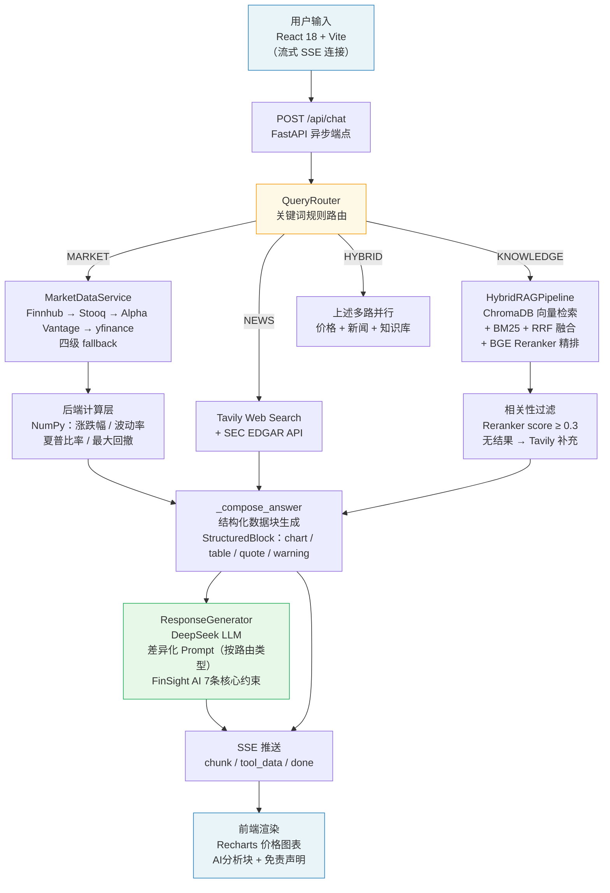

# FinSight AI — 金融资产智能问答系统

基于大模型的全栈金融资产问答系统，支持实时行情查询、多源新闻归因分析、RAG知识检索和合规拒绝，采用结构化数据与LLM分析双轨并行架构。

---

## 系统架构



---

## 技术选型

| 层级 | 技术 | 选型理由 |
|------|------|---------|
| 前端框架 | React 18 + Vite | 轻量快速，原生支持 SSE 流式渲染 |
| UI 图表 | Recharts | React 生态，声明式 API，适合金融时间序列折线/面积图 |
| 后端框架 | FastAPI (Python 3.11) | 异步原生支持，适合并行工具调用；自动生成 OpenAPI 文档 |
| LLM | DeepSeek（OpenAI 兼容接口） | 中文金融场景理解强，temperature=0.3 兼顾准确性与可读性 |
| Embedding | BAAI/bge-base-zh-v1.5 | 中文语义检索 SOTA，768 维，支持零样本迁移 |
| Reranker | BAAI/bge-reranker-base | Cross-Encoder 精排，相比 Bi-Encoder 显著提升 top-1 准确率 |
| 向量数据库 | ChromaDB (PersistentClient) | 轻量嵌入式，无需独立服务，已索引 2013 个 chunk |
| BM25 检索 | rank-bm25 + jieba | 中文分词 BM25，与向量检索通过 RRF 融合互补 |
| 行情数据 | Finnhub + Stooq + Alpha Vantage + yfinance | 四级 fallback 保障可用性，覆盖美股/港股/A股/加密货币 |
| 新闻搜索 | Tavily API | 专为 AI 应用设计，结构化返回 snippet，适合归因分析 |
| 财报数据 | SEC EDGAR API | 官方数据源，免费可靠，覆盖全部美股上市公司 10-K/8-K |
| 缓存 | Redis（可选降级） | 价格缓存 60s TTL，历史数据 24h TTL，无 Redis 时自动跳过 |
| 数据校验 | Pydantic v2 + Pydantic-Settings | 强类型约束，.env 自动注入，API 响应结构标准化 |

---

## Prompt 设计思路

### 系统级约束（FinSight AI 7条核心原则）

`prompts.yaml` 中 generator 的 system prompt 为 LLM 建立了不可逾越的行为边界：

1. **数据优先**：所有数字结论只能来自 `api_data` 字段，禁止自行编造价格或涨跌幅
2. **分析有据**：每个推断观点必须关联到具体数据点，使用"根据以上数据""可能的原因是"等限定词显式标注
3. **坦诚不足**：数据缺失时明确写"基于现有数据无法判断"，禁止用模糊表述掩盖信息缺口
4. **不做预测**：禁止出现"将上涨""预计下跌""目标价"等预测性表述
5. **不给建议**：禁止出现"建议买入""推荐配置""值得投资"等投资建议
6. **结构清晰**：先核心结论（1-2句），再展开分析，不冗长铺垫
7. **格式精简**：输出纯正文，不加"AI分析"等标题，前端统一在 `analysis` 块外层添加视觉标签

### 差异化 User Prompt（按路由类型）

用 Jinja2 条件块实现三类回答结构，同一 system prompt 下产出风格明确分离：

| 路由类型 | 回答结构约束 | 示例效果 |
|---------|------------|---------|
| `market` | 第一句必须报价格/涨跌数字，分析部分≤120字，不重复表格数据 | "TSLA 当前价格 395.01 USD，近7日上涨 +2.30%…" |
| `news / hybrid` | 归因必须引用具体新闻标题和来源；无新闻时明确说明无归因依据 | "根据路透社3月10日报道…市场预期升温" |
| `knowledge` | 定义 → 公式/机制 → 实例应用 → 常见误区 四段式结构 | 先给P/E定义，再给公式，再举行业对比案例 |

### Hallucination 控制策略

- **架构层隔离**：价格、涨跌幅等定量数据由模板引擎（`_compose_answer`）生成，不经过 LLM，LLM 仅在此基础上做语言组织
- **Reranker 门槛过滤**：知识检索结果经 BGE Reranker 打分，score < 0.3 的 chunk 不传入 LLM context
- **Prompt 硬约束**：user_template 末尾明确要求"严格基于以上数据，而非示例数据生成分析"
- **合规拦截层**：`refuses_advice` 标志在路由阶段触发，直接返回固定拒绝文本，LLM 不参与

---

## 数据来源

| 数据类型 | 来源 | 覆盖范围 |
|---------|------|---------|
| 实时价格 | Finnhub API（主力）→ Stooq → Alpha Vantage → yfinance | 美股、港股、A股、加密货币、外汇 |
| 历史K线 | Stooq CSV、Alpha Vantage TIME_SERIES_DAILY、yfinance | 日线 OHLCV，最长支持 5 年 |
| 新闻事件 | Tavily Web Search API | 实时网页检索，结构化摘要 |
| 财报/公告 | SEC EDGAR API | 美股 10-K、10-Q、8-K 全量 |
| 金融知识库 | 32 个自建 Markdown 文档 | 估值/财报/技术分析/宏观/衍生品等，2013 个向量 chunk |
| 实体识别 | 硬编码映射表（30 条）+ 正则提取 | 覆盖主流中文公司名→ticker，支持 A股6位代码和港股 .HK 格式 |

---

## 优化与扩展思考

**1. 实时资讯流接入**
当前新闻数据依赖 Tavily 通用搜索，延迟和覆盖面受限。若接入专业金融资讯流（如财联社、彭博 B-PIPE），可将 RAG 数据源从静态知识库扩展为实时滚动语料，显著提升归因分析的时效性和深度。

**2. 知识库增量更新自动化**
系统已有 `RAGPipeline.add_documents()` 接口和 `create_enhanced_index(clear_existing=False)` 增量模式，具备接入自动化管道的基础。可配置定期爬取金融监管文件、研报摘要，触发增量向量化后写入 ChromaDB，无需重建全量索引。

**3. 检索策略 A/B 测试框架**
当前已有向量+Reranker（高精度）和 token 匹配（高速）两条检索路径，但路径选择硬编码。建议引入基于 query 置信度的动态路径选择，并埋点记录用户对两类结果的满意度，以此驱动检索策略的数据驱动优化。

**4. 多轮对话上下文记忆**
当前每次请求相互独立，无法承接"上一个问题里的茅台"这类省略指代。可在 session 维度维护短期对话历史（最近3-5轮），将上下文摘要注入 QueryRouter 的实体提取阶段，低成本实现基本的多轮连贯性。

**5. LLM 路由替代关键词路由**
当前 `QueryRouter` 基于关键词集合做规则匹配，对复杂意图（如"比较贵州茅台和五粮液哪个更值得长期持有"）识别准确率有限。可将 `prompts.yaml` 中已有的 LLM Router prompt 作为高置信度 fallback，在关键词路由输出低于阈值（0.8）时切换到 LLM 分类，兼顾响应速度和意图准确率。

---

## 快速启动

```bash
# 后端
cd backend
pip install -r requirements.txt
cp .env.example .env   # 填入 DEEPSEEK_API_KEY / FINNHUB_API_KEY / TAVILY_API_KEY
uvicorn app.main:app --host 0.0.0.0 --port 8001 --reload

# 前端
cd frontend
npm install
npm run dev            # 访问 http://localhost:5173
```

> Redis 为可选依赖，未启动时系统自动跳过缓存层，功能不受影响。

---

*以上内容仅供参考，不构成投资建议。*
