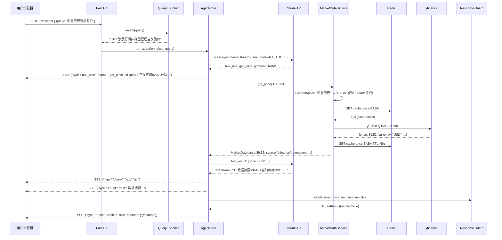
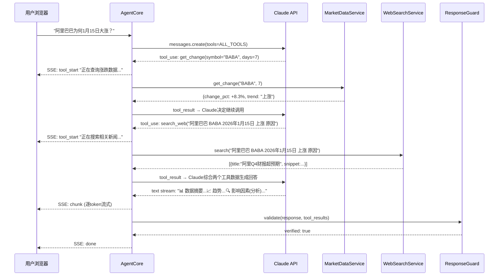
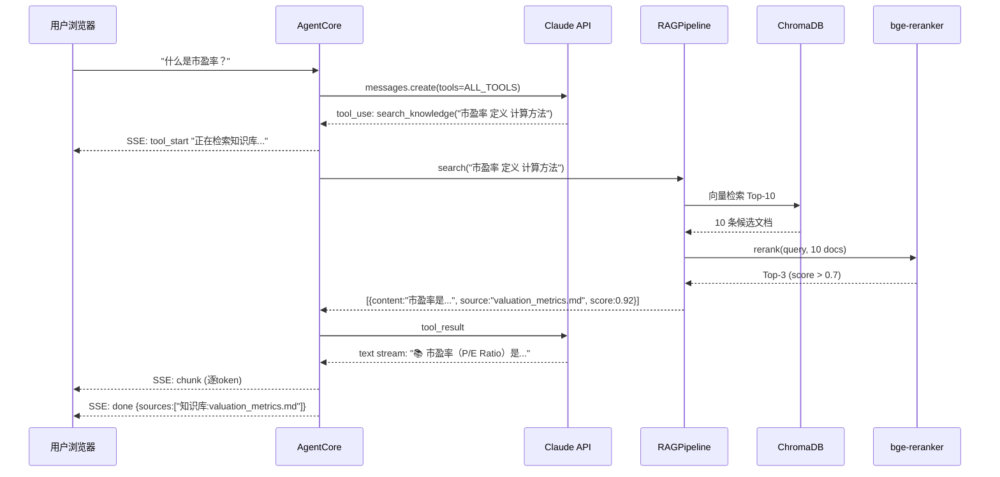
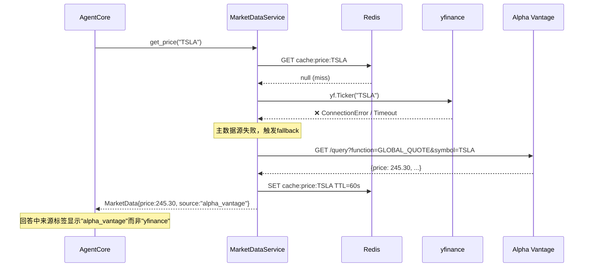

# 金融资产问答系统 — 技术方案

| 版本 | 日期 | 修改人 | 修改内容 |
|------|------|--------|----------|
| V2.0 | 2026-03-04 | 系统架构组 | 全面重写：补充架构组件图、时序图、数据库设计、API接口定义 |

---

## 1. 架构设计

### 1.1 系统组件图

```
┌───────────────────────────────────────────────────────────────────┐
│                         用户浏览器                                 │
│                   React 18 + Vite + TailwindCSS                   │
│                   (ChatPanel / StockCard / TrendChart)             │
└────────────────────────────┬──────────────────────────────────────┘
                             │ HTTPS POST /api/chat
                             │ Response: text/event-stream (SSE)
                             ▼
┌────────────────────────────────────────────────────────────────────┐
│                      FastAPI (Uvicorn, Port 8000)                  │
│                                                                    │
│  ┌─────────────┐   ┌──────────────┐   ┌────────────────────────┐  │
│  │ API Router  │──▶│QueryEnricher │──▶│   AgentCore            │  │
│  │ (routes.py) │   │(规则提示注入)│   │   (Claude Tool Use     │  │
│  └─────────────┘   └──────────────┘   │    循环 + 流式输出)    │  │
│                                        └──────┬─────────────────┘  │
│                                               │ 调用6个Tool        │
│          ┌────────────────────────────────────┼──────────────┐     │
│          │                                    │              │     │
│          ▼                                    ▼              ▼     │
│  ┌───────────────┐              ┌──────────────────┐ ┌───────────┐│
│  │MarketDataSvc  │              │  RAGPipeline     │ │WebSearch  ││
│  │               │              │                  │ │Service    ││
│  │ TickerMapper  │              │ bge-base-zh      │ │           ││
│  │      │        │              │     │            │ │  Tavily   ││
│  │      ▼        │              │     ▼            │ │  API      ││
│  │  yfinance ◄───┤── fallback──▶│  ChromaDB        │ └───────────┘│
│  │  (主数据源)   │  Alpha       │     │            │              │
│  │      │        │  Vantage     │     ▼            │              │
│  │      ▼        │  (备数据源)  │  bge-reranker    │              │
│  │   Redis ◄─────┘              └──────────────────┘              │
│  │  (缓存)       │                                                │
│  └───────────────┘                                                │
│                                                                    │
│  ┌──────────────────┐   ┌────────────────────────────────┐        │
│  │  ResponseGuard   │   │  Structured Logger             │        │
│  │  (数字校验)      │   │  (JSON日志 → tool_calls.log)   │        │
│  └──────────────────┘   └────────────────────────────────┘        │
└────────────────────────────────────────────────────────────────────┘

外部依赖：
┌──────────────┐  ┌──────────────┐  ┌──────────────┐  ┌──────────────┐
│ Claude API   │  │ yfinance     │  │Alpha Vantage │  │ Tavily API   │
│ (Anthropic)  │  │ (Yahoo)      │  │  (备用行情)   │  │ (Web搜索)    │
└──────────────┘  └──────────────┘  └──────────────┘  └──────────────┘
```

### 1.2 组件清单与职责

| 组件 | 技术 | 端口/地址 | 职责 |
|------|------|-----------|------|
| 前端 | React 18 + Vite + TypeScript | localhost:5173 | 用户交互、SSE消息渲染、行情卡片/图表展示 |
| 后端 | FastAPI + Uvicorn | localhost:8000 | API网关、Agent调度、工具执行、流式响应 |
| Redis | Redis 7 | localhost:6379 | 行情数据缓存（价格60s / 历史24h / 公司信息7d） |
| ChromaDB | ChromaDB (嵌入式) | 本地文件存储 | 金融知识库向量索引与检索 |
| Claude API | Anthropic API | api.anthropic.com | LLM推理、Tool Use决策、回答生成 |
| yfinance | Python库 | — | 行情数据主数据源（美股/A股/港股/加密货币） |
| Alpha Vantage | REST API | alphavantage.co | 行情数据备用数据源（主源故障时自动切换） |
| Tavily | REST API | api.tavily.com | 新闻/事件搜索（返回结构化摘要） |
| bge-base-zh | 本地模型 | — | 中文文本向量化（Embedding） |
| bge-reranker | 本地模型 | — | 检索结果精排（Cross-Encoder） |

### 1.3 组件间通信方式

| 调用方 | 被调用方 | 协议 | 说明 |
|--------|----------|------|------|
| 前端 → 后端 | FastAPI | HTTP POST + SSE | 前端发POST，后端返回text/event-stream |
| 后端 → Claude | Anthropic API | HTTPS + Streaming | 使用SDK stream模式，逐token返回 |
| 后端 → yfinance | yfinance库 | 内部函数调用 | 同步库，用asyncio.to_thread包装 |
| 后端 → Alpha Vantage | REST API | HTTPS GET | 仅在yfinance失败时触发 |
| 后端 → Tavily | REST API | HTTPS POST | 搜索新闻，返回JSON摘要 |
| 后端 → Redis | redis-py | TCP 6379 | 缓存读写，支持TTL |
| 后端 → ChromaDB | chromadb库 | 内部函数调用 | 嵌入式向量数据库，本地持久化 |

---

## 2. 业务逻辑

### 2.1 核心业务流程

用户发送问题 → 系统自动识别问题类型 → 调用相应数据源获取事实数据 → LLM基于事实数据生成结构化回答 → 校验后返回用户。

核心原则：**所有金融数字必须来自工具调用，LLM只负责理解问题和组织回答，不负责提供事实。**

### 2.2 请求处理时序图

#### 场景1：行情查询（"阿里巴巴当前股价"）



#### 场景2：复合查询（"阿里巴巴为何1月15日大涨"）



#### 场景3：知识问答（"什么是市盈率"）



#### 场景4：行情数据源故障降级



---

## 3. 数据库设计

本系统有三个数据存储：Redis（缓存）、ChromaDB（向量）、JSON日志文件（审计）。

### 3.1 Redis 缓存结构

Redis 用于缓存行情数据，减少外部 API 调用频率。

#### Key 命名规范

```
{数据类型}:{股票代码}:{参数}
```

#### 缓存条目定义

| Key 格式 | 值类型 | TTL | 示例Key | 说明 |
|----------|--------|-----|---------|------|
| `price:{symbol}` | JSON String | 60秒 | `price:BABA` | 实时价格数据 |
| `history:{symbol}:{days}` | JSON String | 24小时 | `history:BABA:30` | 历史K线数据 |
| `change:{symbol}:{days}` | JSON String | 60秒 | `change:BABA:7` | 涨跌幅计算结果 |
| `info:{symbol}` | JSON String | 7天 | `info:BABA` | 公司基本面信息 |

#### 各缓存值的字段结构

**price:{symbol}**

| 字段 | 类型 | 说明 |
|------|------|------|
| symbol | string | 股票代码，如"BABA" |
| price | float | 当前价格 |
| currency | string | 币种，如"USD"、"CNY" |
| name | string | 公司名称 |
| source | string | 数据来源："yfinance" 或 "alpha_vantage" |
| timestamp | string (ISO8601) | 数据获取时间 |

**history:{symbol}:{days}**

| 字段 | 类型 | 说明 |
|------|------|------|
| symbol | string | 股票代码 |
| days | int | 请求天数 |
| data | array | K线数据数组（见下方子结构） |
| source | string | 数据来源 |
| timestamp | string | 获取时间 |

data 数组中每条记录：

| 字段 | 类型 | 说明 |
|------|------|------|
| date | string (YYYY-MM-DD) | 日期 |
| open | float | 开盘价 |
| high | float | 最高价 |
| low | float | 最低价 |
| close | float | 收盘价 |
| volume | int | 成交量 |

**change:{symbol}:{days}**

| 字段 | 类型 | 说明 |
|------|------|------|
| symbol | string | 股票代码 |
| days | int | 统计天数 |
| start_price | float | 起始价格 |
| end_price | float | 结束价格 |
| change_pct | float | 涨跌幅百分比（如+8.3） |
| trend | string | 趋势判断："上涨" / "下跌" / "震荡" |
| source | string | 数据来源 |
| timestamp | string | 获取时间 |

**info:{symbol}**

| 字段 | 类型 | 说明 |
|------|------|------|
| symbol | string | 股票代码 |
| name | string | 公司全称 |
| sector | string | 所属行业 |
| industry | string | 细分行业 |
| market_cap | int | 总市值（美元） |
| pe_ratio | float / null | 市盈率（亏损时为null） |
| 52w_high | float | 52周最高价 |
| 52w_low | float | 52周最低价 |
| description | string | 公司简介（截取前300字符） |
| source | string | 数据来源 |
| timestamp | string | 获取时间 |

### 3.2 ChromaDB 向量库结构

ChromaDB 用于存储金融知识库的文档向量，供RAG检索使用。

**Collection名称：** `financial_knowledge`

**距离度量：** cosine

| 字段 | 类型 | 说明 |
|------|------|------|
| id | string | 文档唯一标识，格式：`{文件名}_{chunk序号}`，如 `valuation_metrics_3` |
| document | string | 文档块的原始文本内容 |
| embedding | float[] (768维) | bge-base-zh-v1.5生成的向量 |
| metadata.source | string | 来源文件路径，如 `valuation_metrics.md` |
| metadata.chunk_index | int | 在原文中的块序号 |
| metadata.heading | string | 所属的 Markdown 标题，如 `## 市盈率 (P/E Ratio)` |

**知识库文件清单：**

| 文件名 | 内容 | 预估块数 |
|--------|------|---------|
| valuation_metrics.md | 估值指标（PE/PB/PS/EV-EBITDA） | ~8 |
| financial_statements.md | 三大报表（收入/净利/现金流） | ~10 |
| technical_analysis.md | 技术分析基础（均线/MACD/RSI） | ~8 |
| market_instruments.md | 金融工具（股票/ETF/债券/期权） | ~8 |
| macro_economics.md | 宏观经济（GDP/CPI/利率/汇率） | ~6 |

### 3.3 审计日志结构

所有工具调用记录到 `logs/tool_calls.jsonl`，每行一条JSON。

| 字段 | 类型 | 说明 |
|------|------|------|
| timestamp | string (ISO8601) | 事件时间 |
| request_id | string (UUID) | 请求唯一标识 |
| event | string | 事件类型："tool_call" / "tool_result" / "guard_check" / "agent_complete" |
| tool | string | 工具名称，如 "get_price" |
| params | object | 工具调用参数，如 {"symbol":"BABA"} |
| latency_ms | int | 执行耗时（毫秒） |
| status | string | "success" / "error" / "fallback" |
| data_source | string | 实际使用的数据源 |
| cache_hit | boolean | 是否命中缓存 |
| error_message | string / null | 错误信息（成功时为null） |
| tokens_in | int | Claude调用输入token数（仅agent_complete事件） |
| tokens_out | int | Claude调用输出token数（仅agent_complete事件） |

---

## 4. API 接口定义

### 4.1 POST /api/chat

**描述：** 接收用户问题，返回SSE流式响应。

#### 请求

| 参数名 | 位置 | 类型 | 必填 | 说明 |
|--------|------|------|------|------|
| Content-Type | Header | string | 是 | 固定值 `application/json` |
| query | Body | string | 是 | 用户问题文本，长度1-500字符 |
| session_id | Body | string | 否 | 会话ID，用于未来多轮对话。不传时每次请求独立。 |

**请求示例：**
```json
POST /api/chat
Content-Type: application/json

{
  "query": "阿里巴巴最近为何1月15日大涨？",
  "session_id": "sess_abc123"
}
```

#### 响应

| 参数名 | 类型 | 说明 |
|--------|------|------|
| Content-Type | Header | `text/event-stream` |
| 响应体 | SSE stream | 每行以 `data: ` 开头，内容为JSON |

#### SSE 事件类型

**event: tool_start**

| 字段 | 类型 | 说明 |
|------|------|------|
| type | string | 固定 `"tool_start"` |
| name | string | 工具名称，如 `"get_price"` |
| display | string | 展示文案，如 `"正在查询BABA行情..."` |

**event: tool_data**

| 字段 | 类型 | 说明 |
|------|------|------|
| type | string | 固定 `"tool_data"` |
| tool | string | 工具名称 |
| data | object | 工具返回的结构化数据（StockData / SearchResult等） |

**event: chunk**

| 字段 | 类型 | 说明 |
|------|------|------|
| type | string | 固定 `"chunk"` |
| text | string | 文本片段（逐token） |

**event: done**

| 字段 | 类型 | 说明 |
|------|------|------|
| type | string | 固定 `"done"` |
| verified | boolean | ResponseGuard校验是否通过 |
| sources | Source[] | 数据来源列表 |
| request_id | string | 请求唯一标识（用于日志追踪） |

Source 结构：

| 字段 | 类型 | 说明 |
|------|------|------|
| name | string | 来源名称，如 `"yfinance"` / `"知识库"` / `"Tavily"` |
| timestamp | string | 数据获取时间 |

**event: error**

| 字段 | 类型 | 说明 |
|------|------|------|
| type | string | 固定 `"error"` |
| message | string | 错误描述 |
| code | string | 错误码：`"TIMEOUT"` / `"LLM_ERROR"` / `"DATA_UNAVAILABLE"` |

**完整SSE响应示例：**
```
data: {"type":"tool_start","name":"get_change","display":"正在查询BABA涨跌数据..."}

data: {"type":"tool_data","tool":"get_change","data":{"symbol":"BABA","change_pct":8.3,"trend":"上涨"}}

data: {"type":"tool_start","name":"search_web","display":"正在搜索相关新闻..."}

data: {"type":"chunk","text":"📊 "}

data: {"type":"chunk","text":"数据摘要"}

data: {"type":"chunk","text":"\n"}

data: {"type":"chunk","text":"BABA近7日涨幅+8.3%..."}

data: {"type":"done","verified":true,"sources":[{"name":"yfinance","timestamp":"2026-03-04T14:30:00Z"},{"name":"Tavily","timestamp":"2026-03-04T14:30:01Z"}],"request_id":"req_xyz789"}
```

**错误码说明：**

| 错误码 | HTTP状态码 | 说明 |
|--------|-----------|------|
| TIMEOUT | 200 (SSE内) | 外部API调用超时，部分数据不可用 |
| LLM_ERROR | 200 (SSE内) | Claude API返回错误 |
| DATA_UNAVAILABLE | 200 (SSE内) | 行情数据双源均不可用 |
| INVALID_QUERY | 422 | 请求参数校验失败（非SSE，直接返回JSON） |

### 4.2 GET /api/health

**描述：** 系统健康检查。

#### 请求

无参数。

#### 响应

| 字段 | 类型 | 说明 |
|------|------|------|
| status | string | `"healthy"` 或 `"degraded"` |
| version | string | 系统版本号 |
| timestamp | string | 当前服务器时间 |
| components | object | 各组件状态 |

**响应示例：**
```json
{
  "status": "healthy",
  "version": "1.0.0",
  "timestamp": "2026-03-04T14:30:00Z",
  "components": {
    "redis": "connected",
    "chromadb": "ready",
    "claude_api": "reachable",
    "yfinance": "available"
  }
}
```

### 4.3 GET /api/chart/{symbol}

**描述：** 获取指定股票的历史价格数据，供前端图表渲染。

#### 请求

| 参数名 | 位置 | 类型 | 必填 | 说明 |
|--------|------|------|------|------|
| symbol | Path | string | 是 | 股票代码，如 `BABA` |
| days | Query | int | 否 | 历史天数，默认30，范围7-365 |

**请求示例：**
```
GET /api/chart/BABA?days=30
```

#### 响应

| 字段 | 类型 | 说明 |
|------|------|------|
| symbol | string | 股票代码 |
| data | PricePoint[] | 价格数据数组 |
| source | string | 数据来源 |

PricePoint 结构：

| 字段 | 类型 | 说明 |
|------|------|------|
| date | string | 日期 YYYY-MM-DD |
| open | float | 开盘价 |
| high | float | 最高价 |
| low | float | 最低价 |
| close | float | 收盘价 |
| volume | int | 成交量 |

**响应示例：**
```json
{
  "symbol": "BABA",
  "data": [
    {"date":"2026-02-03","open":82.10,"high":83.50,"low":81.20,"close":82.95,"volume":12500000},
    {"date":"2026-02-04","open":83.00,"high":84.20,"low":82.80,"close":83.80,"volume":11800000}
  ],
  "source": "yfinance"
}
```

---

## 5. 内部工具接口定义

以下是 Agent 调用的 6 个 Tool 的 JSON Schema 定义，供 Claude Tool Use 使用。

### 5.1 get_price

| 参数名 | 类型 | 必填 | 说明 |
|--------|------|------|------|
| symbol | string | 是 | 股票代码，如 AAPL, BABA, 600519.SS, BTC-USD |

**返回字段：**

| 字段 | 类型 | 说明 |
|------|------|------|
| symbol | string | 股票代码 |
| price | float | 当前价格 |
| currency | string | 币种 |
| name | string | 公司/资产名称 |
| source | string | 数据来源 |
| timestamp | string | 获取时间 |
| error | string / null | 错误信息 |

### 5.2 get_history

| 参数名 | 类型 | 必填 | 说明 |
|--------|------|------|------|
| symbol | string | 是 | 股票代码 |
| days | int | 否 | 历史天数，默认30 |

**返回：** PricePoint 数组（结构同 3.1 history 缓存值的 data 字段）

### 5.3 get_change

| 参数名 | 类型 | 必填 | 说明 |
|--------|------|------|------|
| symbol | string | 是 | 股票代码 |
| days | int | 否 | 统计天数，默认7 |

**返回字段：**

| 字段 | 类型 | 说明 |
|------|------|------|
| symbol | string | 股票代码 |
| days | int | 统计天数 |
| start_price | float | 期初价格 |
| end_price | float | 期末价格 |
| change_pct | float | 涨跌幅百分比 |
| trend | string | "上涨" / "下跌" / "震荡"（阈值±2%） |
| source | string | 数据来源 |
| timestamp | string | 获取时间 |

### 5.4 get_info

| 参数名 | 类型 | 必填 | 说明 |
|--------|------|------|------|
| symbol | string | 是 | 股票代码 |

**返回：** 结构同 3.1 info 缓存值。

### 5.5 search_knowledge

| 参数名 | 类型 | 必填 | 说明 |
|--------|------|------|------|
| query | string | 是 | 检索关键词，如"市盈率 计算方法" |

**返回字段：**

| 字段 | 类型 | 说明 |
|------|------|------|
| documents | array | 检索结果列表（最多3条） |
| documents[].content | string | 文档内容 |
| documents[].source | string | 来源文件名 |
| documents[].score | float | 相关性评分（0-1） |
| total_found | int | 检索到的文档数 |

### 5.6 search_web

| 参数名 | 类型 | 必填 | 说明 |
|--------|------|------|------|
| query | string | 是 | 搜索关键词，如"阿里巴巴 BABA 2026年1月 股价上涨" |

**返回字段：**

| 字段 | 类型 | 说明 |
|------|------|------|
| results | array | 搜索结果列表（最多5条） |
| results[].title | string | 新闻标题 |
| results[].snippet | string | 摘要（200字以内） |
| results[].url | string | 原文链接 |
| results[].published | string | 发布时间 |
| search_query | string | 实际搜索的关键词 |

---

## 6. 备注：未来扩展方向

### 6.1 数据源升级

当前使用免费API（yfinance + Alpha Vantage），生产环境需要：
- **A股数据**：接入东方财富/同花顺/Wind API，解决yfinance对A股支持不稳定的问题
- **实时行情**：当前数据延迟约15分钟，如需实时推送可接入WebSocket行情源
- **数据归一化**：不同数据源返回格式不同，MarketDataService已做抽象层，新数据源只需实现统一接口

### 6.2 知识库扩展

当前5个Markdown文件约8000字，扩展路径：
- **自动化ETL**：接入SEC 10-K/10-Q、公司公告、券商研报，自动分块入库
- **增量更新**：新文档入库不影响已有向量，ChromaDB支持upsert
- **时间感知**：为每个chunk添加时间标签（metadata.date），检索时支持时间过滤
- **向量库迁移**：知识库规模超过10万条时，从ChromaDB迁移至pgvector或Qdrant

### 6.3 多轮对话

当前每次请求独立，不维护上下文。扩展方案：
- **会话存储**：Redis存储session_id → messages历史（TTL 30分钟）
- **上下文压缩**：超过10轮时对历史消息做摘要压缩，避免超出context window
- **代词消解**：用户说"它的市盈率呢"时，需从历史中推断"它"指什么

### 6.4 模型路由

当前固定使用Claude Sonnet，优化方案：
- **简单问题**（纯价格查询、知识库直接回答）→ Claude Haiku（更快更便宜）
- **复杂问题**（多工具组合、需要推理分析）→ Claude Sonnet
- **路由判断**：可复用QueryEnricher的关键词检测，无需额外LLM调用

### 6.5 可观测性

当前仅有结构化日志，生产环境需要：
- **LLM调用追踪**：集成LangSmith或OpenTelemetry，记录每次Claude调用的完整输入输出
- **性能监控**：Prometheus采集延迟、错误率、缓存命中率；Grafana仪表盘
- **成本监控**：按日/周统计token消耗量和API调用费用
- **告警**：数据源连续失败、延迟超阈值时告警通知

### 6.6 Tool并行执行

当前工具串行执行。当Claude在同一轮中请求多个工具时（Anthropic API支持），可以用`asyncio.gather`并行执行，减少约500ms延迟。改动量约10行代码。

---

**文档结束**
