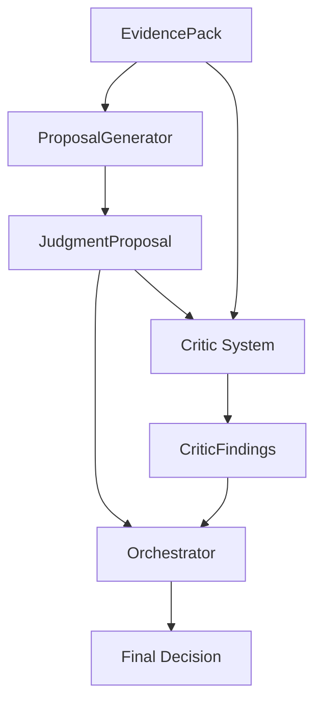

# Judgment Proposal Layer

## Overview
This layer implements a "Proposal-Critic-Decision" architecture. Instead of a single rule engine, it separates the generation of a judgment (Proposal) from the auditing of that judgment (Critics).

## Data Flow

## Components
1. **ProposalGenerator**: Simulates a model proposing an answer (`ALLOW`) based on evidence.
2. **Critics**:
   - `SufficiencyCritic`: Validates retrieval signals.
   - `NumericCritic`: Enforces structured data for numeric intents.
   - `ProvenanceCritic`: Enforces multi-source for comparisons.
3. **Orchestrator**: Aggregates findings. If `BLOCK` severity is found, downgrades `ALLOW` to `REFUSE`.

## Artifacts
Located in `artifacts/judgment_proposal/`:
- `proposal_*.json`: The initial draft.
- `critic_trace_*.json`: The audit log.
- `decision_*.json`: The final verdict and answer.

## Future: Connecting Real LLM
To replace the heuristic `ProposalGenerator`:
1. Create `LLMProposalGenerator`.
2. Use prompt from `trust_rag/core/judgment/templates.py`.
3. Parse LLM JSON output into `JudgmentProposal` model.
4. Pass into `JudgmentOrchestrator`.
