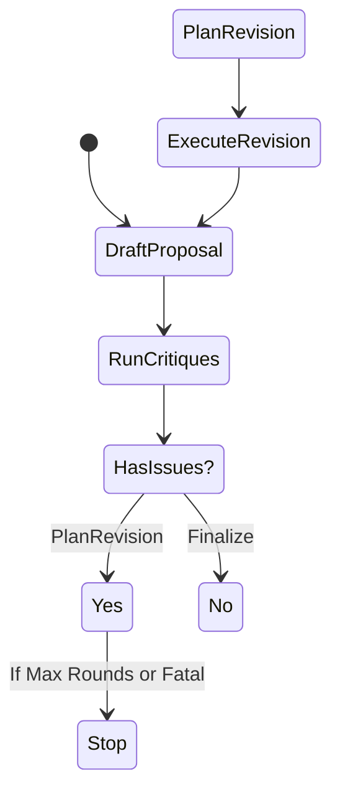

# Judgment Revision Loop

## Overview
This layer implements an iterative "Revision Loop" for auditing and correcting judgment proposals. It moves beyond a linear check to a state machine that can correct proposals or downgrade them safely.

## Loop Architecture

## Key Components
- **loop.py**: The orchestrator managing state (`Round 0..N`).
- **revisor.py**: 
  - `RevisionPlanner`: Maps findings to actions (`REWRITE`, `DOWNGRADE`, `PATCH`).
  - `ProposalReviser`: Applying the actions.
- **models.py**: `RevisionPlan`, `LoopTrace`.

## Artifacts `artifacts/judgment_loop/`
- `loop_trace_*.json`: Contains the full history of the loop.
    - Round 0: Initial Proposal (ALLOW) -> Findings (BLOCK) -> Plan (DOWNGRADE).
    - Round 1: Revised Proposal (REFUSE) -> Finalize.

## Usage
Run `run_judgment_loop.py` to see the loop in action on existing evidence packs.
