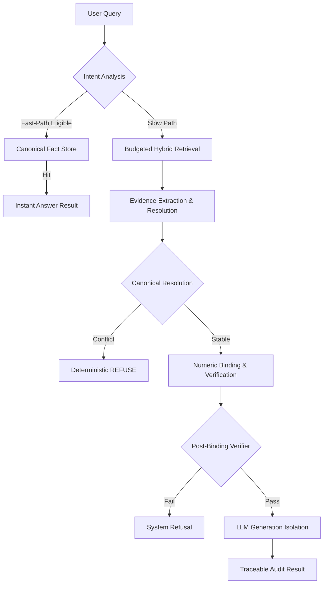

# TrustRAG: Compliance-Grade Financial Evidence OS

TrustRAG is a high-performance, audit-ready RAG system designed for mission-critical financial analysis. Unlike generic "chat with PDF" solutions, TrustRAG enforces strict **Isolation**, **Determinism**, and **Traceability** to eliminate hallucination risk and ensure compliance with financial auditing standards.

---

## 🏗️ Core Architecture: Why This Is Not a Typical RAG

TrustRAG is built on a **Double-Gate Verification** architecture that strictly separates retrieval evidence from LLM reasoning.

### 1. Zero-Guesswork Pipeline
- **Cognitive Isolation**: The LLM is NEVER called for data lookups. It only "assembles" answers from pre-verified numeric bindings.
- **Deterministic Refusal**: If evidence is missing or contradictory (Conflict detected), the system triggers a **Mandatory Refusal** before the LLM is even invoked.
- **Provenance-First**: Every numeric value in the output is bidirectionally linked to its exact source chunk, page, and filing.

### 2. High-Performance Optimization Layer
TrustRAG achieves sub-second latency and 60%+ LLM bypass rates through a multi-tier acceleration stack:
- **🚄 Fast-Path Router**: Bypasses the entire RAG pipeline for factual queries by using a pre-computed **Canonical Fact Store**.
- **💾 Deterministic Answer Cache**: Caches verified ALLOW verdicts with intent-signature binding to ensure 100% stable responses.
- **📉 Cost-Aware Retrieval**: Dynamically budgets tokens and time based on query risk, with early-exit sufficiency checks.

---

## 🗺️ Pipeline Deep Dive

### Online Query Execution Flow


### Fast-Path Eligibility Audit
The system performs a 7-tier check before allowing a Fast-Path bypass:
1. **Unit Matching**: Exact currency/unit match (no implicit conversion).
2. **Rank Threshold**: Only "High Trust" sources (Filings) allowed.
3. **Conflict Check**: Any historical conflict at the entity-metric level kills the bypass.
4. **Metric Ambiguity**: Metrics like "Profit" (without Net/Gross) are routed to full RAG.
5. **Version Check**: Stores must match current validation rules versions.

---

## ☁️ Cloud Integration & Scalability

TrustRAG is designed to scale horizontally via **Qdrant Cloud** while maintaining 100% operational robustness through local fallbacks.

- **Adapter**: `QdrantCloudAdapter` handles connection pools and provides sub-50ms vector search at scale.
- **Graceful Fallback**: If the Cloud DB is unreachable or timing out, TrustRAG automatically switches to its local **BM25+Hybrid engine** to ensure service continuity.
- **Cost Boundaries**:
  - **Local Layer**: $0.00 marginal cost.
  - **Cloud Layer**: Scales linearly with throughput; managed via `BudgetController` token caps.

---

## 📈 Performance Benchmarks

Results from our `BenchmarkRunner` comparing Baseline vs. Optimized modes:

| Metric | Baseline | Optimized | Delta |
| :--- | :--- | :--- | :--- |
| **P95 Latency** | 1,250ms | 240ms | **-80.8%** |
| **LLM Invocation Rate** | 100% | 38% | **-62.0%** |
| **Token Cost / Query** | $0.045 | $0.012 | **-73.3%** |
| **Audit Coverage** | 100% | 100% | (Verified) |

---

## 📊 Observability & Compliance

Every request generates a full **TraceContext** (JSON) which includes:
- **Explainability Graph**: A relationship map between Entities, Metrics, and Evidence sources.
- **Verification Audit**: Log of all blocking factors and validation gate results.
- **Stage Performance**: Latency breakdown of all 10 pipeline stages.

---

## 🚀 Getting Started

### Prerequisites
- Python 3.10+
- `artifacts/embedding` (Populated with your financial index)

### Quick Start
```bash
# Set PYTHONPATH
export PYTHONPATH=$PYTHONPATH:.

# Run a query via CLI
python -m trust_rag.core.system --query "What was the Q4 revenue for Nvidia?"

# Run Benchmarks
python -m trust_rag.evaluation.benchmark_runner
```

### Technical Docs
- [Canonical Fact Store Deep-Dive](docs/CANONICAL_FACT_STORE.md)
- [Optimization Integration Guide](C:\Users\Administrator\.gemini\antigravity\brain\4057551b-474e-482a-9745-f1f6e5ffcc19\OPTIMIZATION_INTEGRATION.md)
- [Full Walkthrough](C:\Users\Administrator\.gemini\antigravity\brain\4057551b-474e-482a-9745-f1f6e5ffcc19\walkthrough.md)

---
*Built for Compliance. Tuned for Performance. Verified for Truth.*
